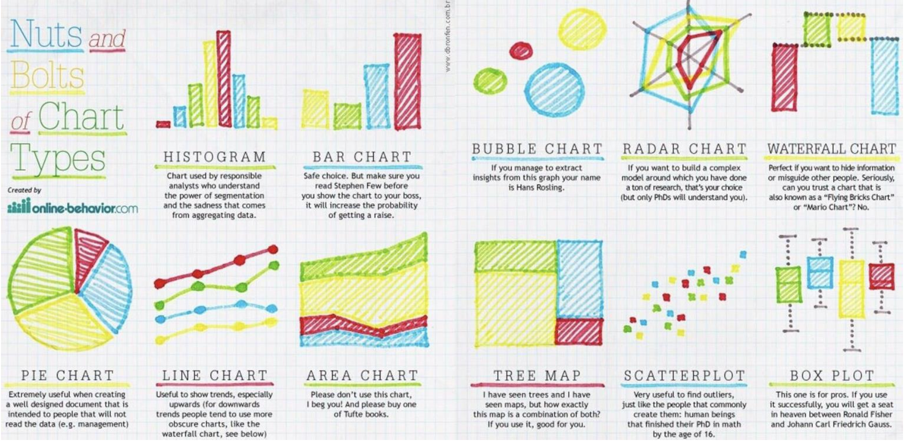

## Data visualization
When approaching an AI problem in general or an Object Detection problem in particular, understanding and grasping the data is crucial for developing an effective problem-solving strategy and model building.

1. Statistics on the information about width and height of images in data

2. Statistics on the number of bounding boxes (objects to be detected) in the image

3. Statistics about the size of bouding boxes

4. Statistics on the number of each object in the class

## Data labeling

## Polar vs Pandas
In a word: performance. Polars was built from the ground up to be blazingly fast and can do common operations around 5–10 times faster than pandas. In addition, the memory requirement for Polars operations is significantly smaller than for pandas: pandas requires around 5 to 10 times as much RAM as the size of the dataset to carry out operations, compared to the 2 to 4 times needed for Polars.

You can get an idea of how Polars performs compared to other dataframe libraries here. As you can see, Polars is between 10 and 100 times as fast as pandas for common operations and is actually one of the fastest DataFrame libraries overall. Moreover, it can handle larger datasets than pandas can before running into out-of-memory errors.