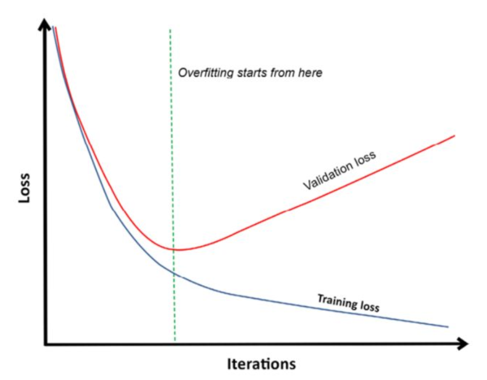

## Bias and variance
- Bias thể hiện việc model chưa đủ phức tạp để học và bao quát hết data.
- Variance thể hiện việc model quá phức tạp để học trên bộ dữ liệu. Model quá chú
trọng vào chi tiết và nhiễu bên trong data .

## Trying different splitting strategies

- The basic train-test split

- Probabilistic evaluation method

- Probabilistic evaluation methods

