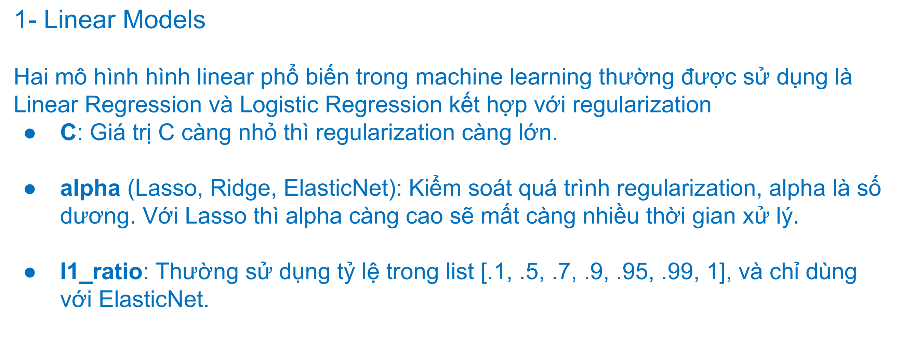

- parameter : learn from data, update during training and optimize model performance
- hyperparameter : set up manually, no updates during training, control the training process and find the most effective model.

## AutoML

## Linear Models

## SVM

## Random forest

## How to choose best hyperparameter?
- Grid Search 
- Random Search
- Halving Search
- Bayesian 