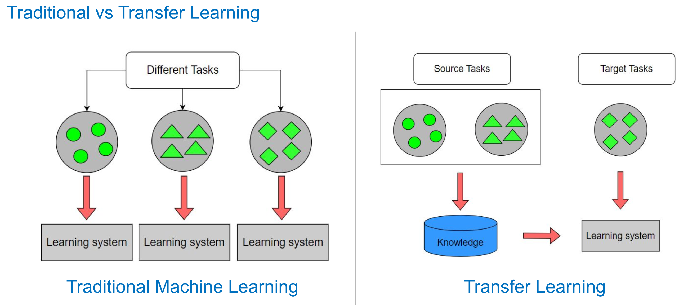
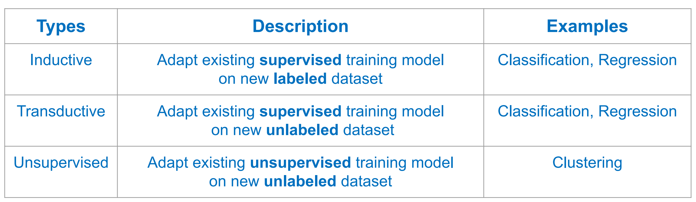
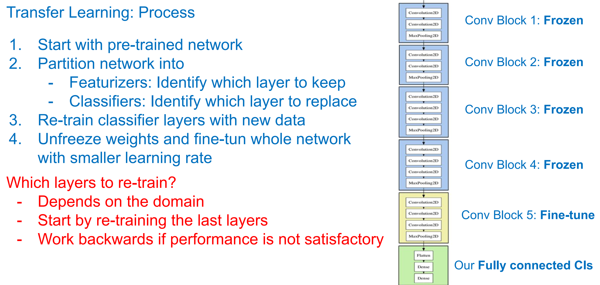
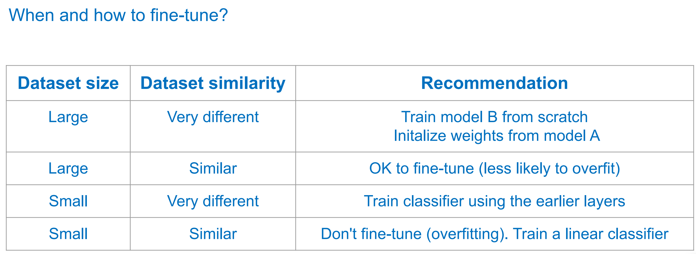
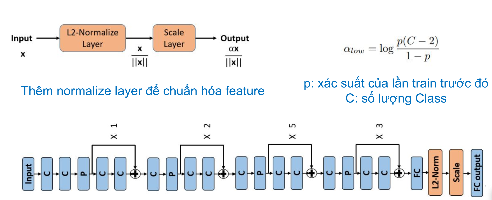
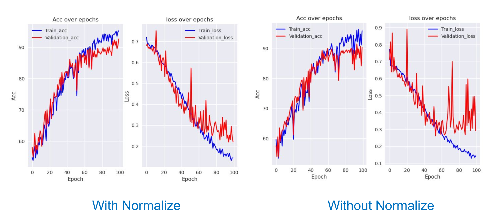
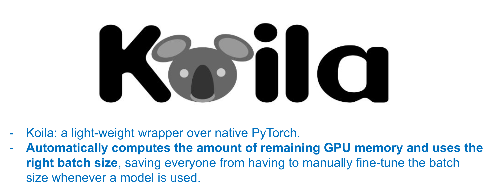
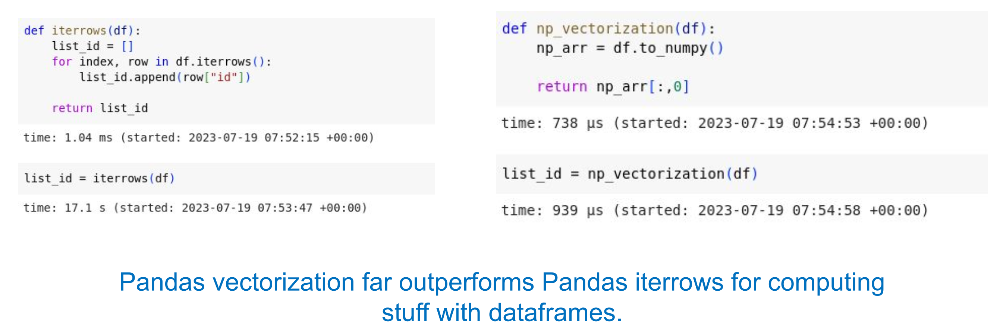
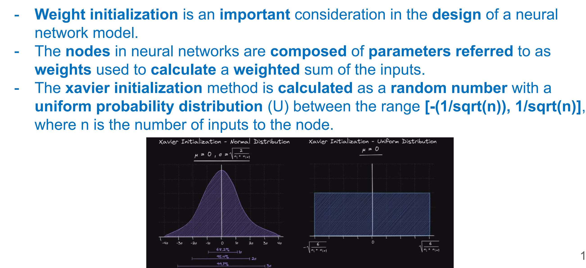
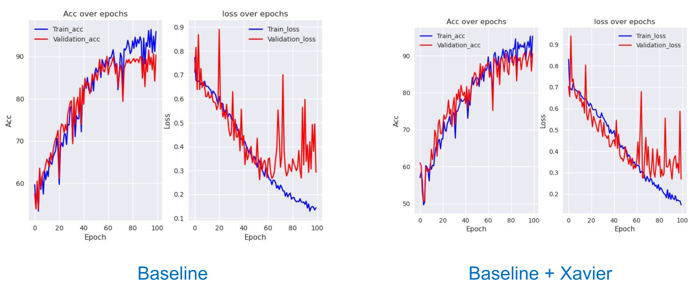

## transfer learning

## Normalize

## Prevents Cuda error: out of memory
ánh xạ tới ram, và tự update batch-size

## Iterate over rows in dataframe

## Xavier Init

## No bias decay
- weight decay : đưa các trọng số về gần bằng 0 -> có thể làm mất biến b
- No bias decay không làm mất biến b trong đường thẳng ax + b vì mô hình sẽ bị underfit