## Convolutional operation
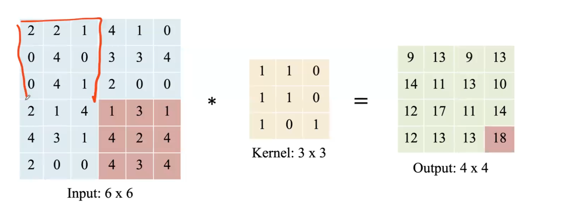
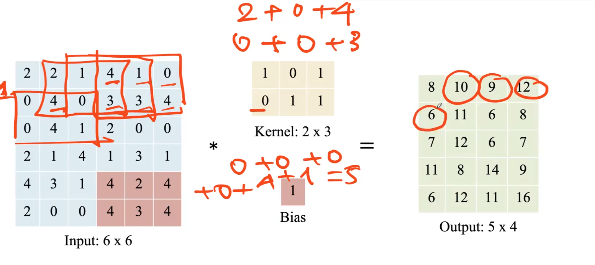
## Padding
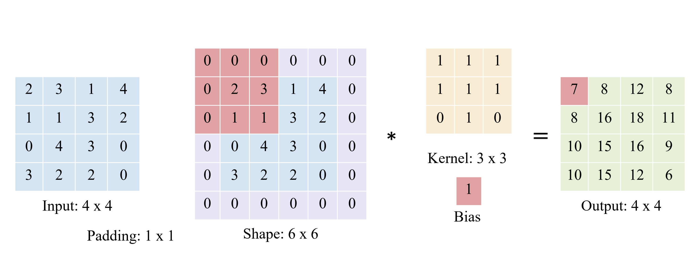
- padding = 'same' : shape out = shape input
- để có thêm nhiều lớp hơn
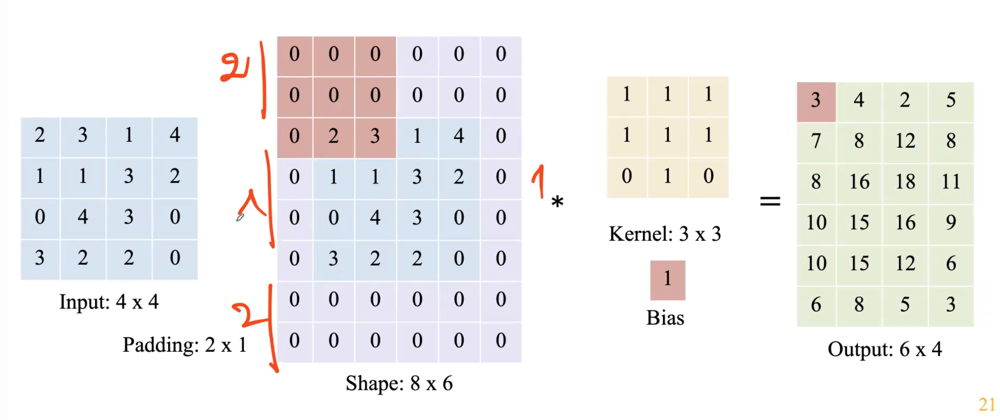
## Stride
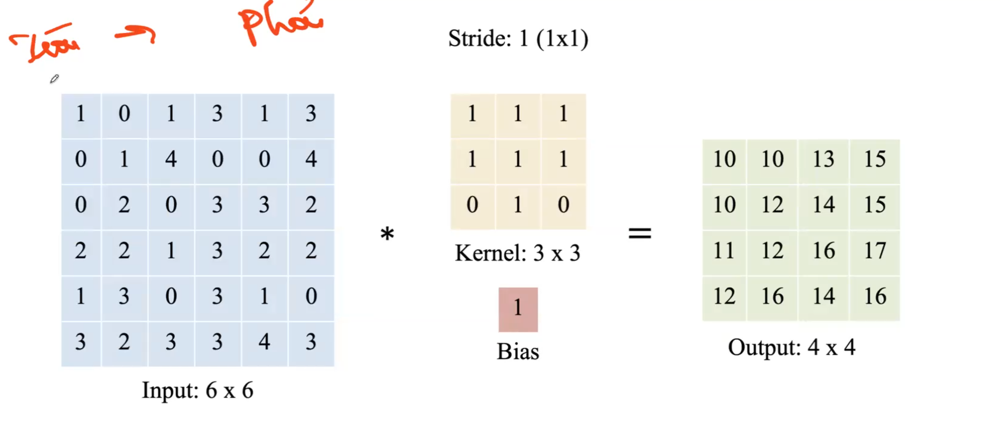
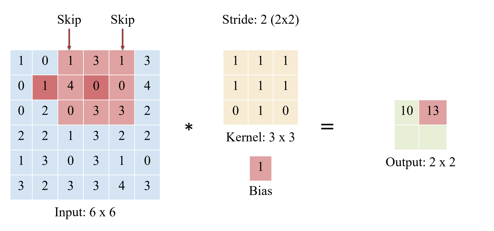
## Max pooling
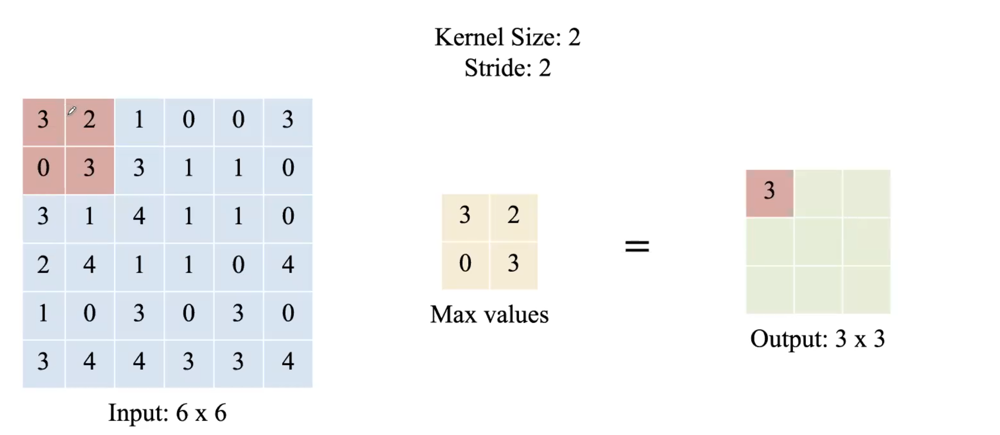
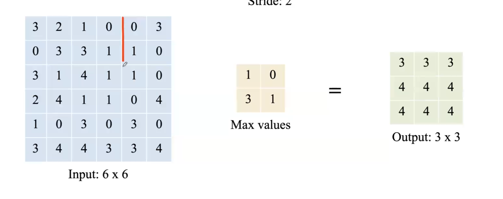
## Average pooling
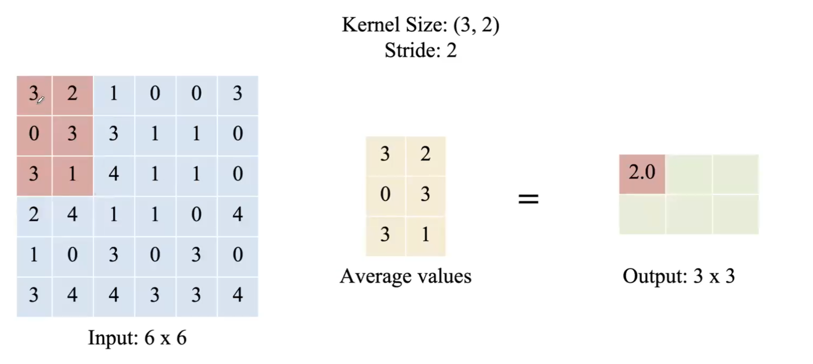
## 1x1 convolution
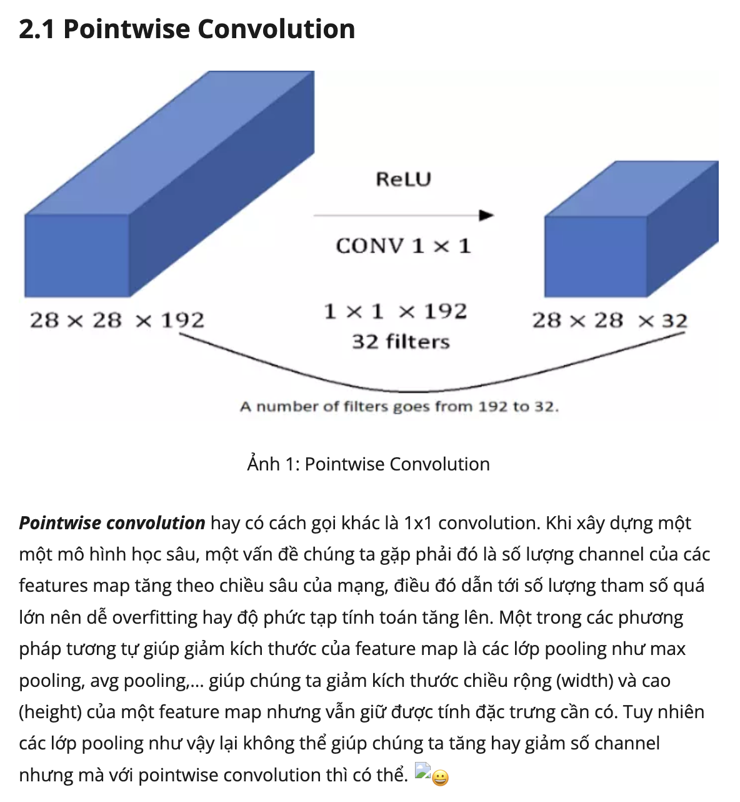
---
## From MLP to CNN
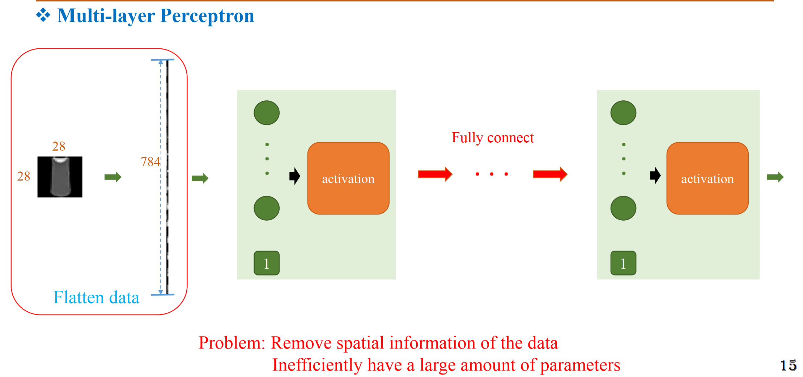
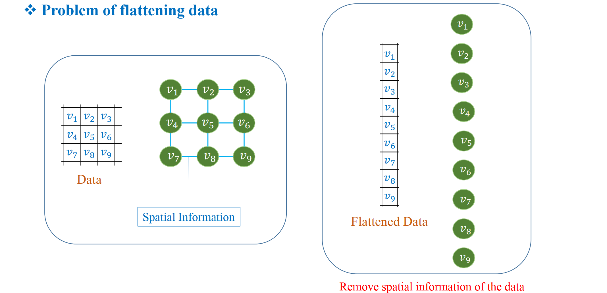
 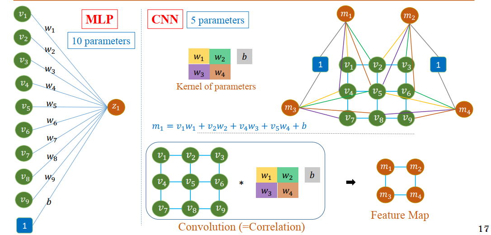
 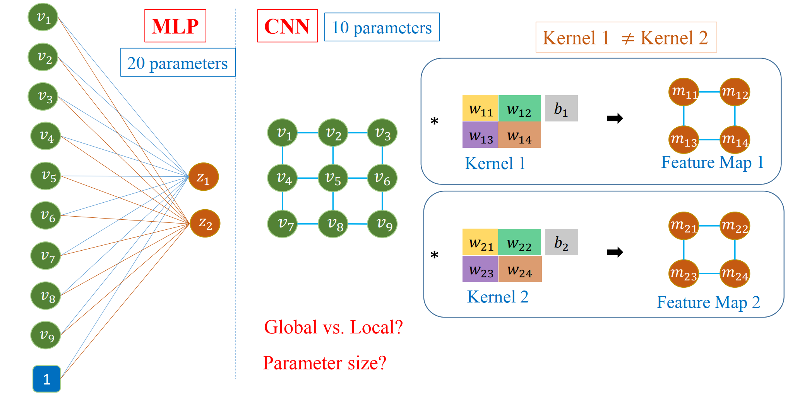
 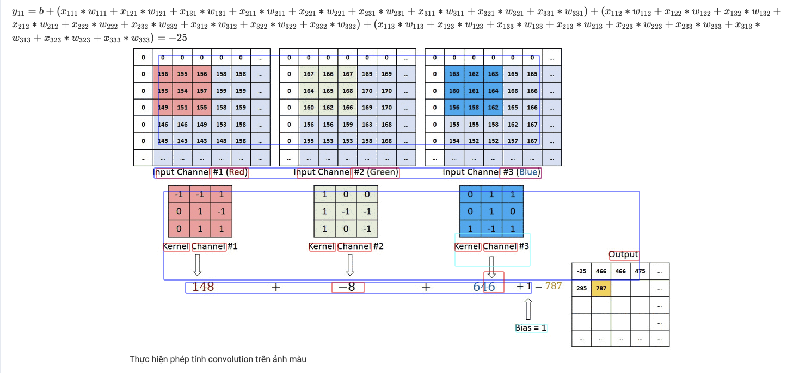
 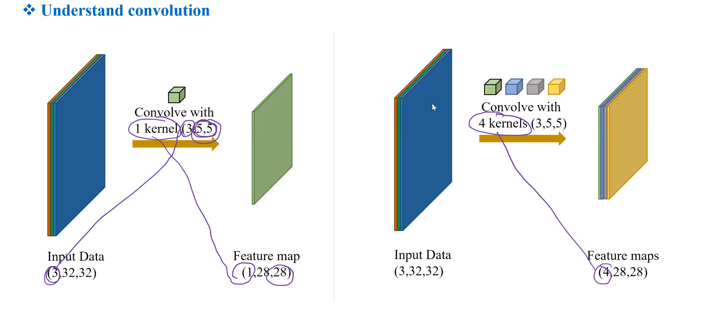

