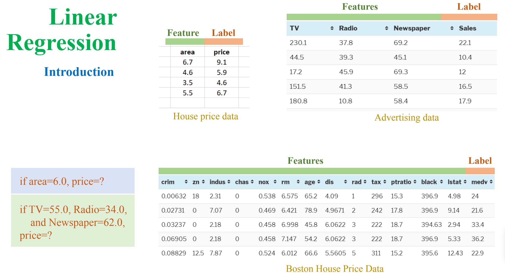
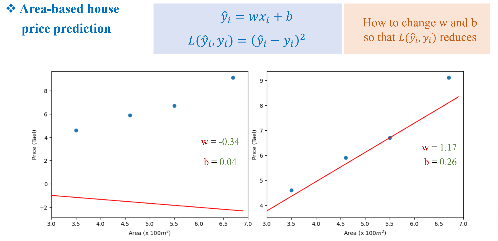
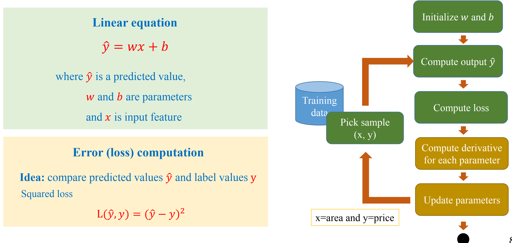
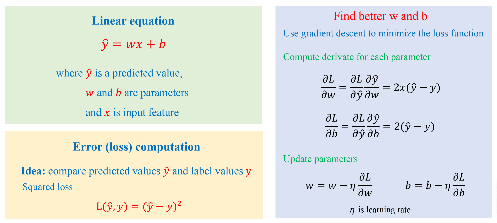
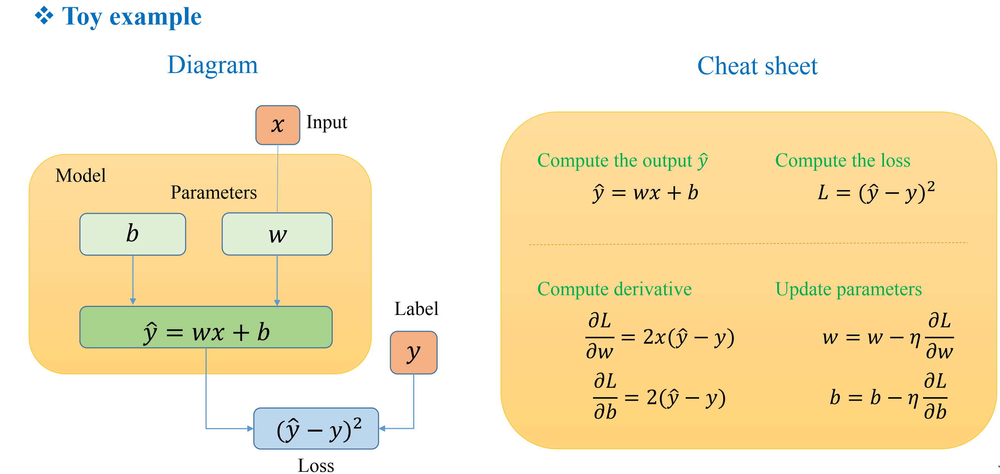
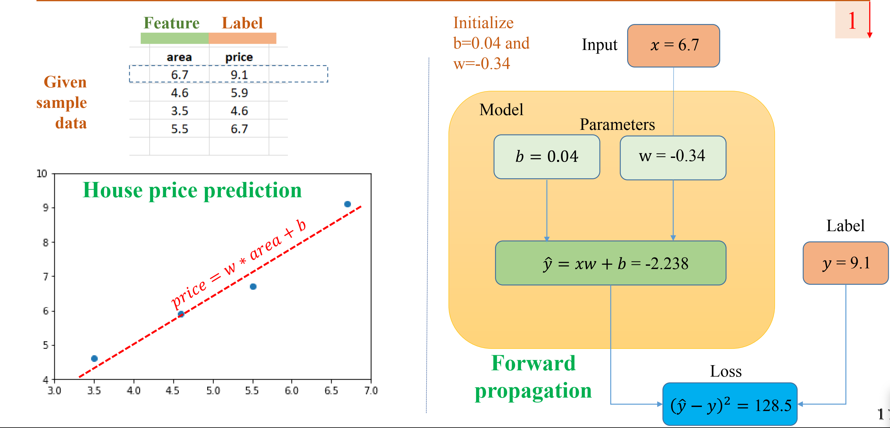
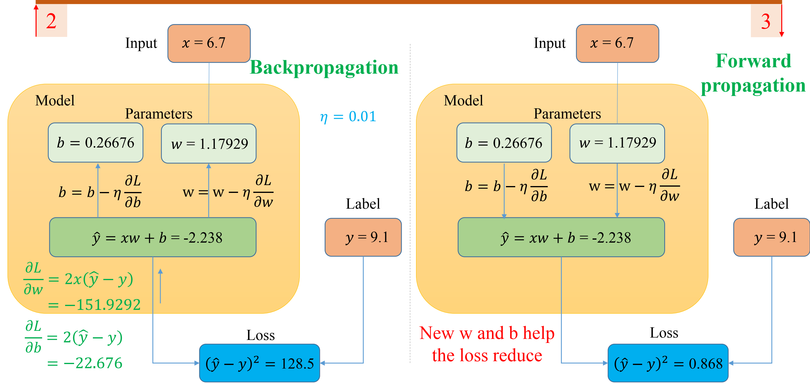
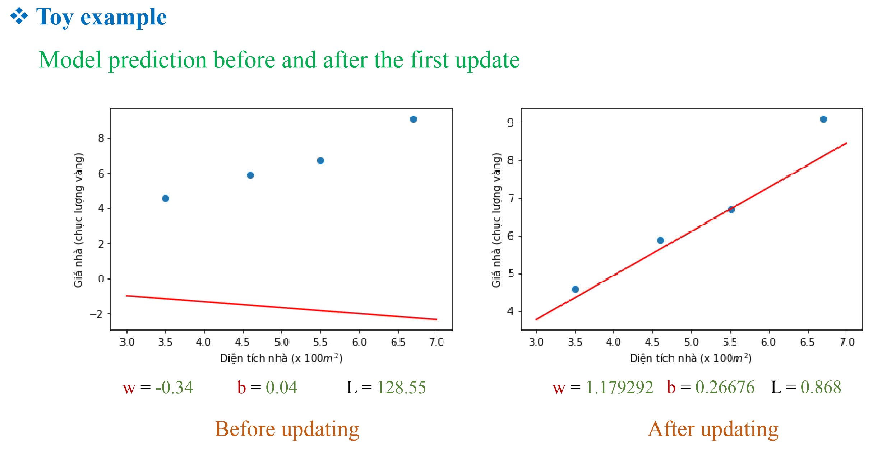
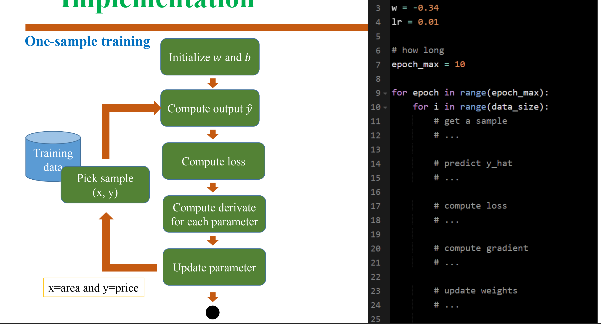
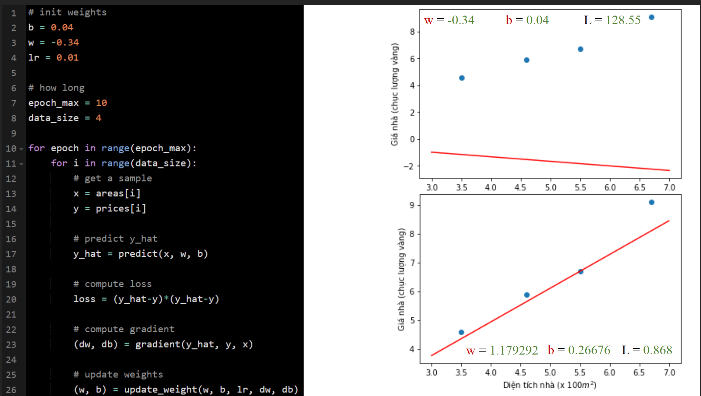

Linear regression is a fundamental statistical method used for modeling the relationship between a dependent variable (what you are trying to predict) and one or more independent variables (what you are using to predict the dependent variable). This relationship is modeled using a linear equation.

- Forward propagation

- backpropagation

## One-sample training

## m-sample training (1 < m < N)
