## Activation
Convert the model results from linear to nonlinear
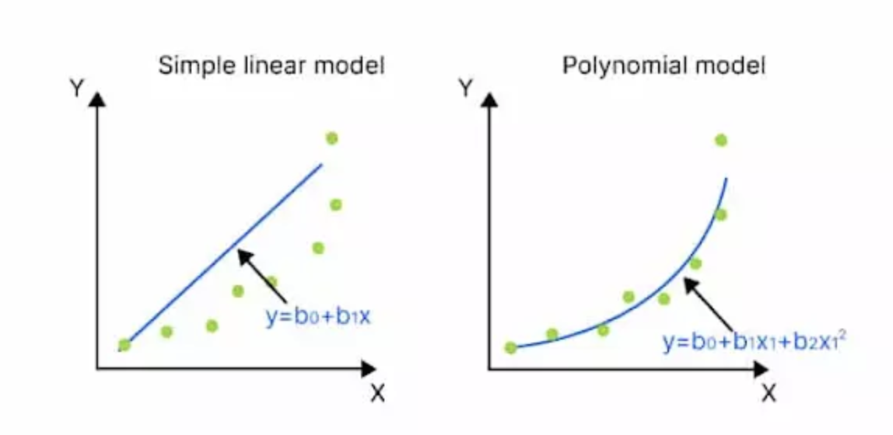
## Derivative and applications
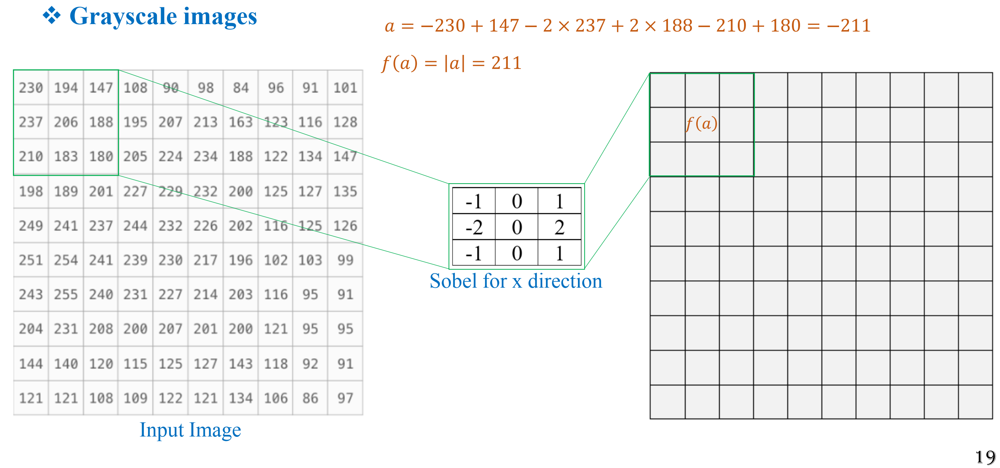
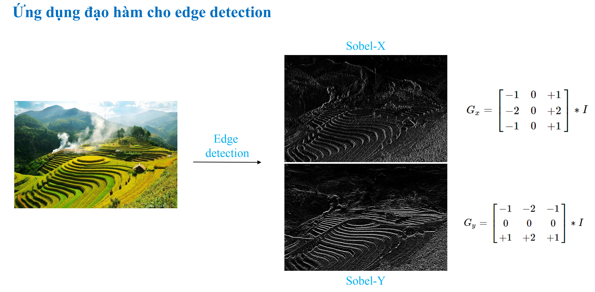
## Stochastic gradient descent
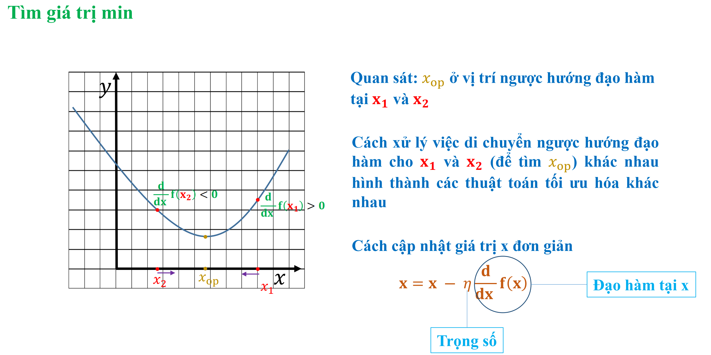
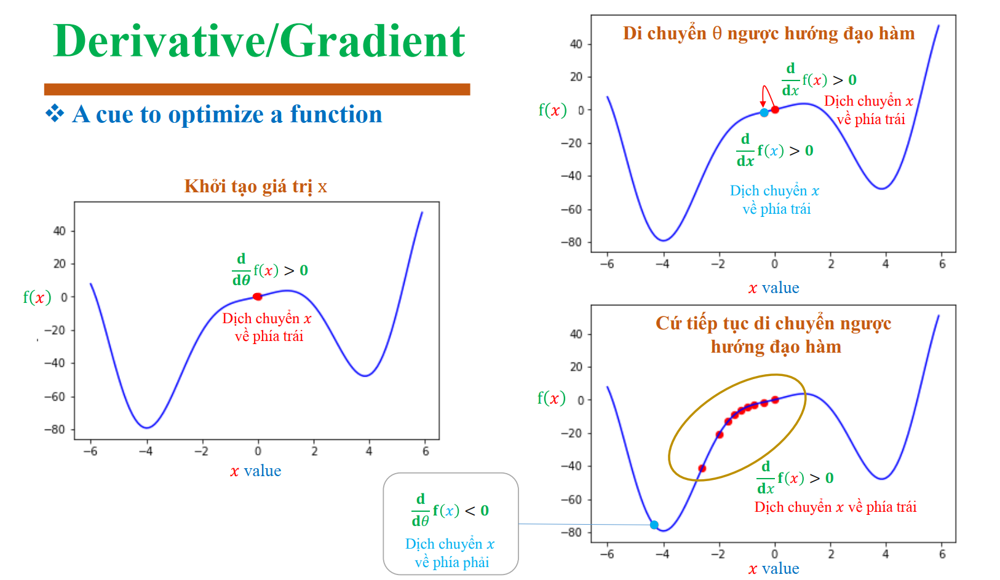
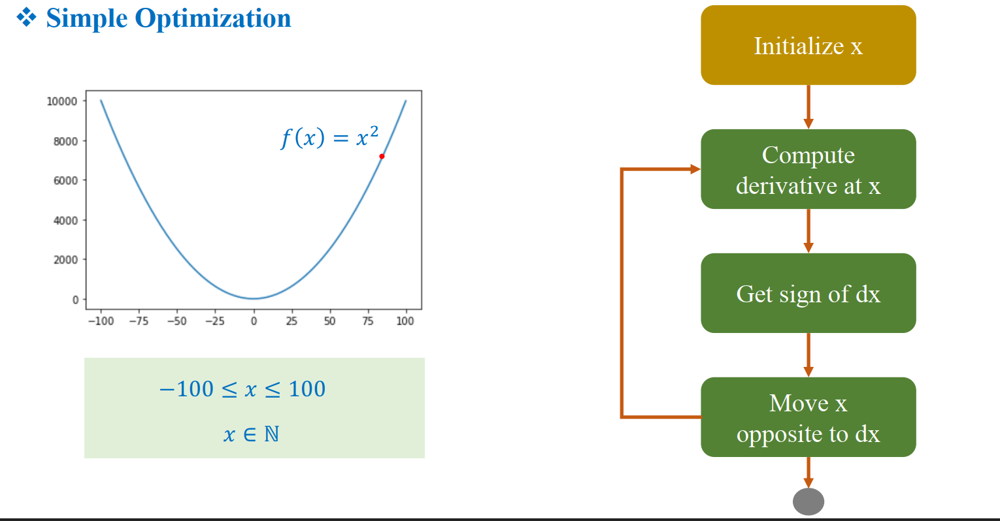
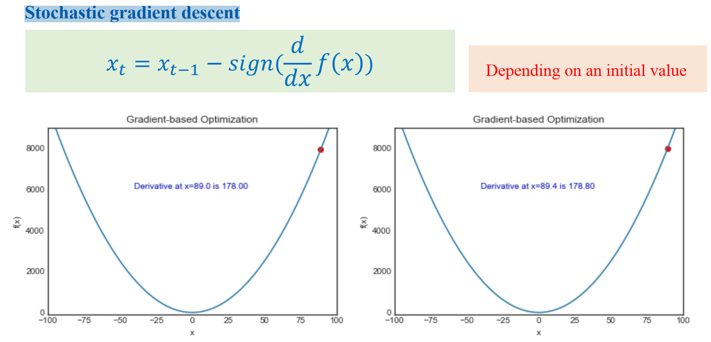
- Challenges
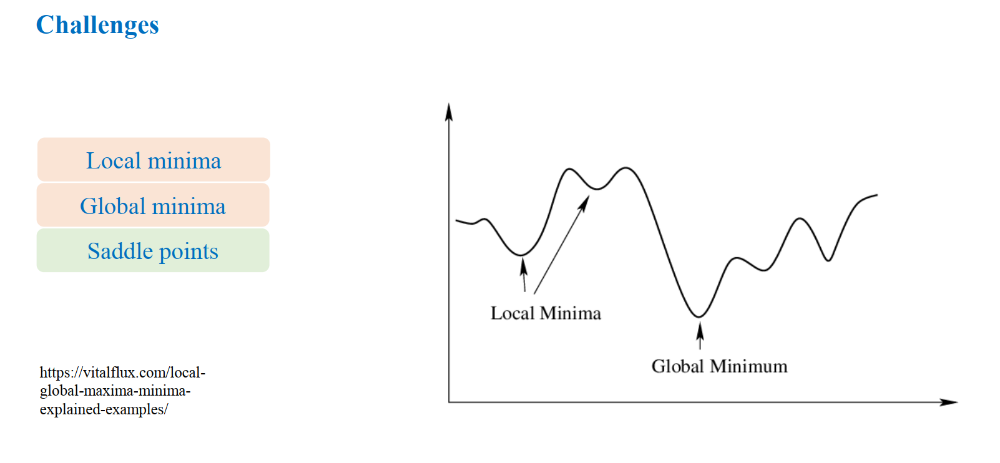
## SGD + momentum
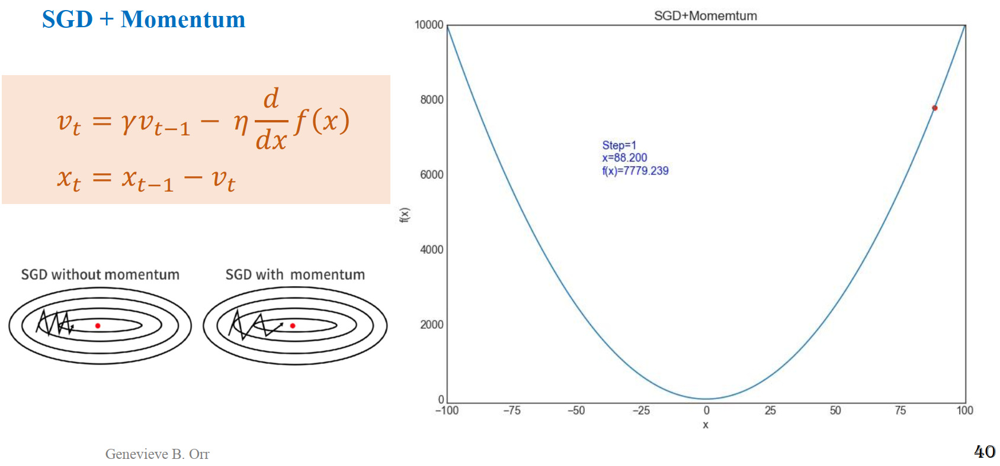
## Slope of the Line
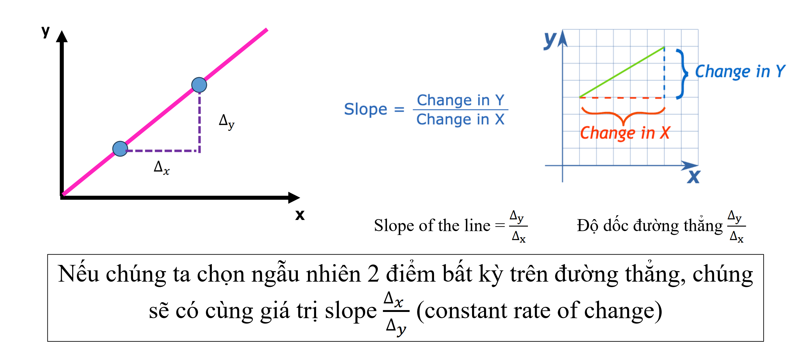
## Slope of the Curve
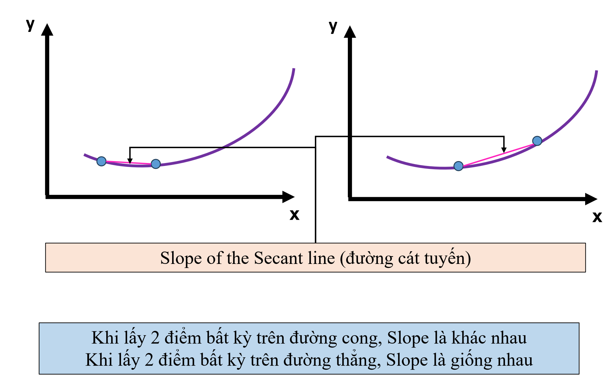
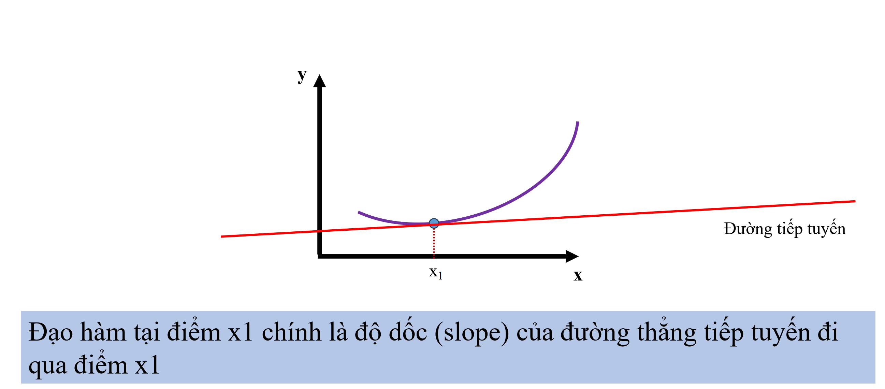