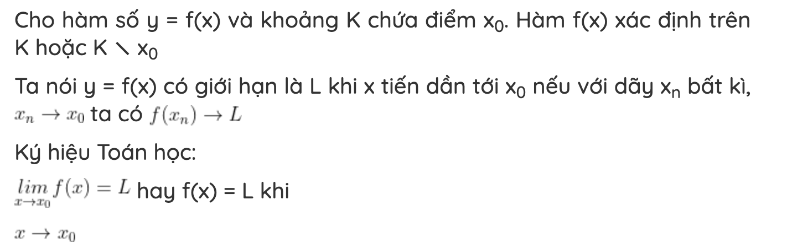
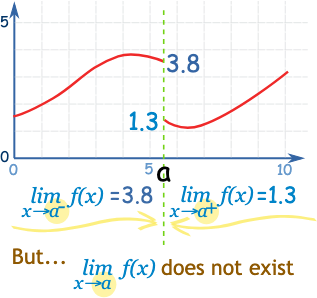
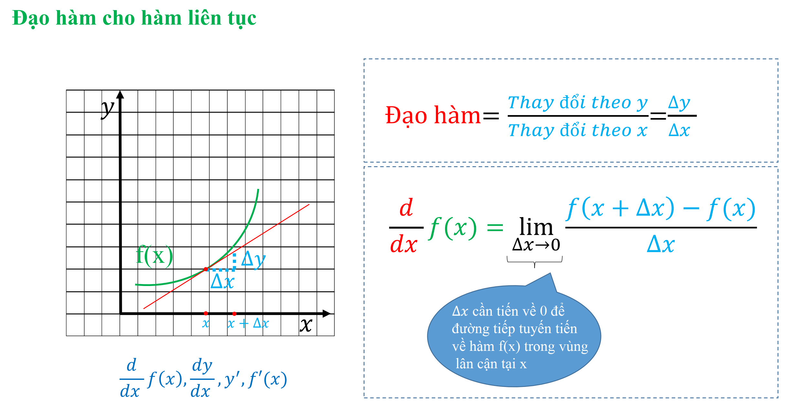
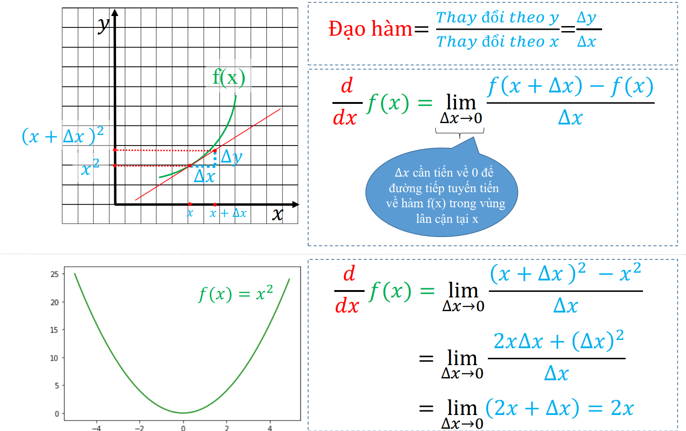
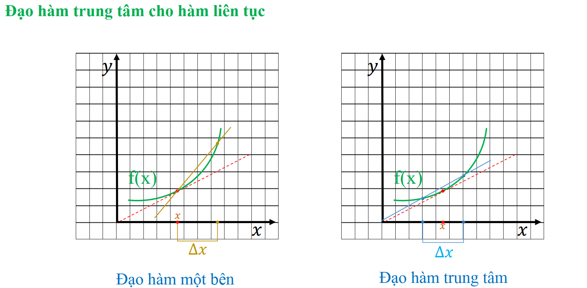
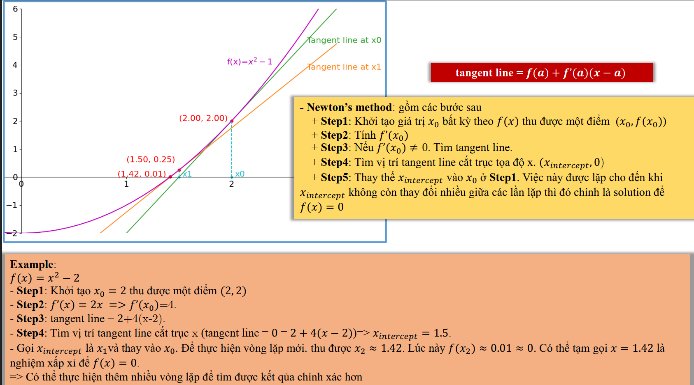
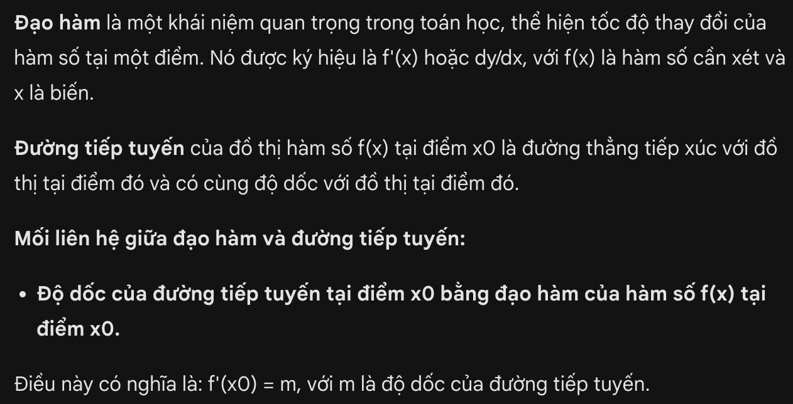
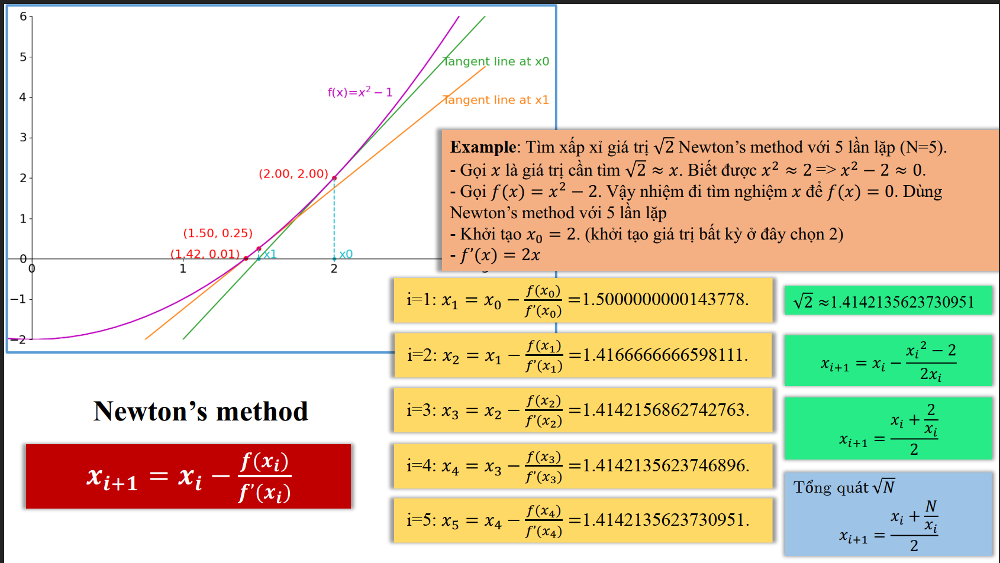
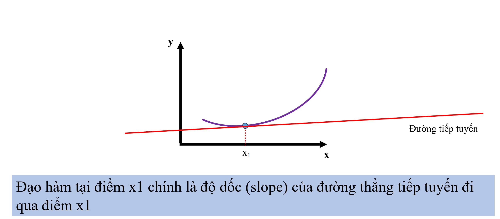

## Limit
In mathematics, the limit of a function as its input approaches a specific value represents the value the function approaches as the input gets infinitely close to that value. This concept is used in calculus and optimization techniques in machine learning.

## Derivative

A derivative represents the rate of change of a function at a particular point

The central derivative is more accurate than the one-sided derivative
## Newton's method
VÍ dụ muốn tính căn(2)

