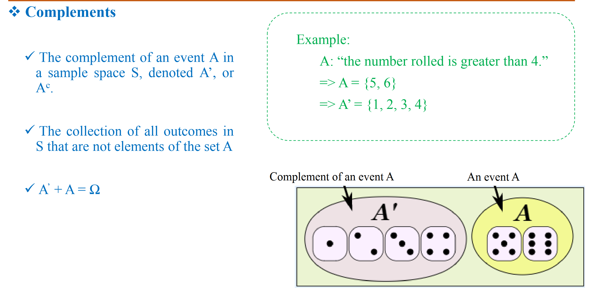

## Introduction

## Theory of probability

- Tiên đề

- conditional probability

- Xác suất toàn phần

- Xác xuất Bayes

## Naive Bayes Classifier
## Event

- intersection

- Union of events

- Independent event

## Bayes' Rule

- Simple classification

