## Exponential Functions
Exponential functions model a relationship in which a constant change in the independent variable gives the same proportional change in the dependent variable
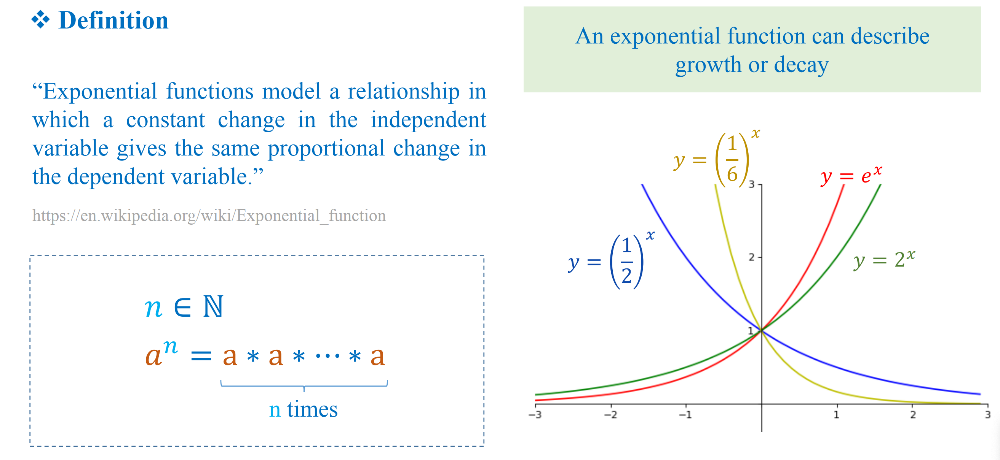
## Sigmoid Function
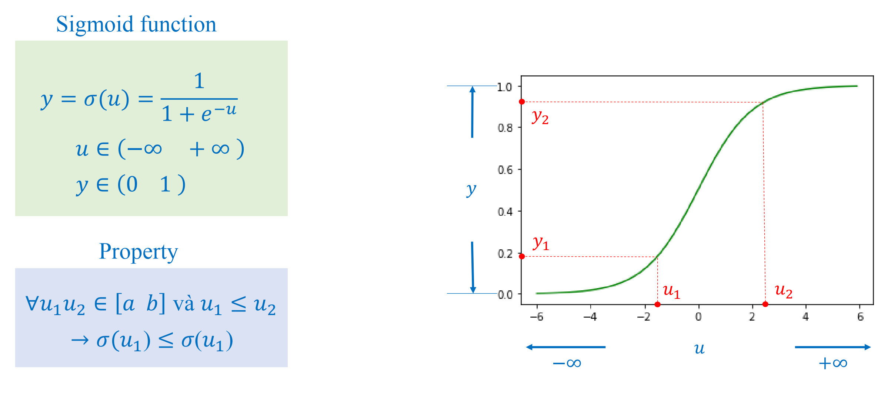
## Softmax function
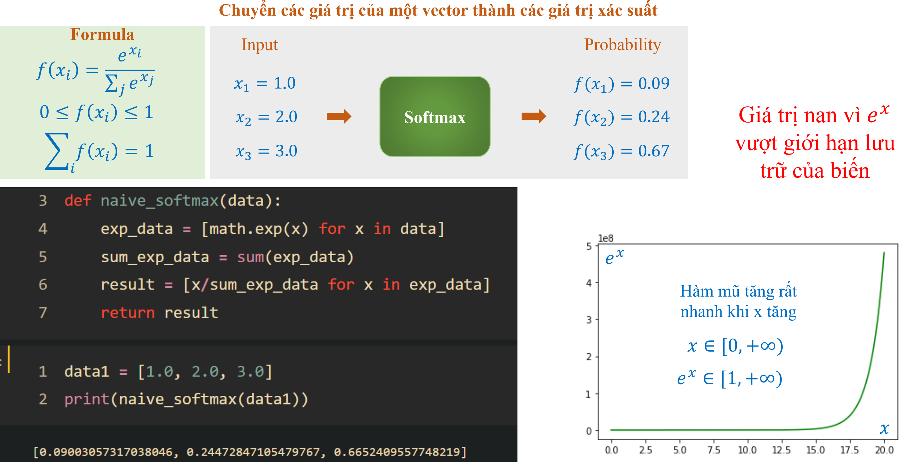
## Logarithmic Function
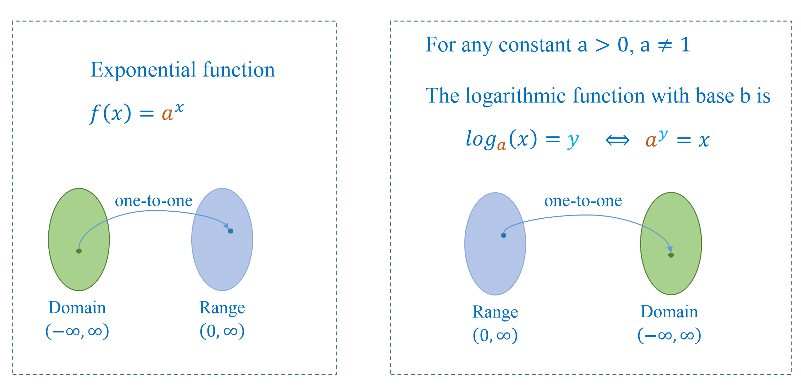
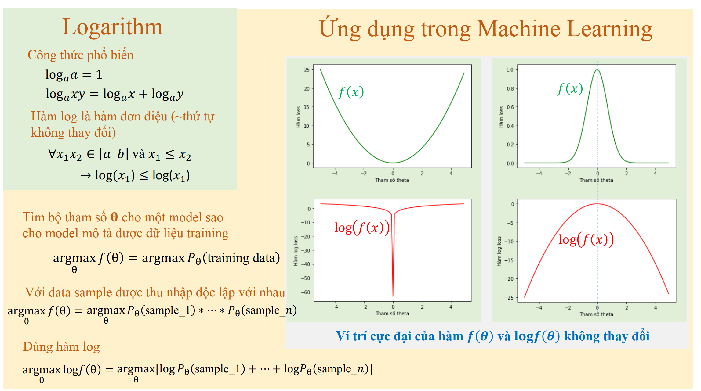
## Relative order of numbers is presserved
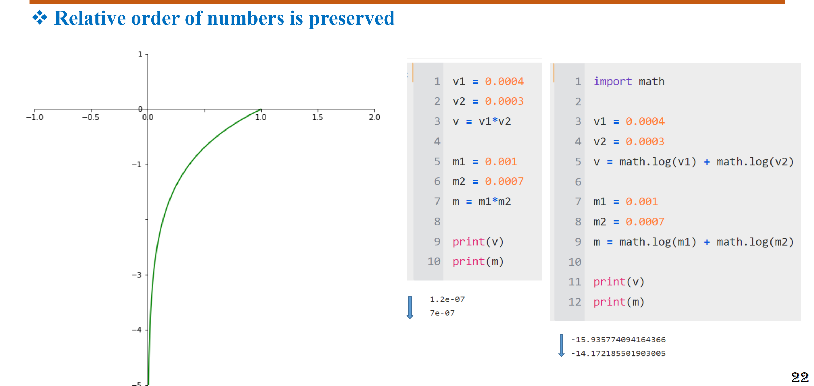
## Suggested fuctions
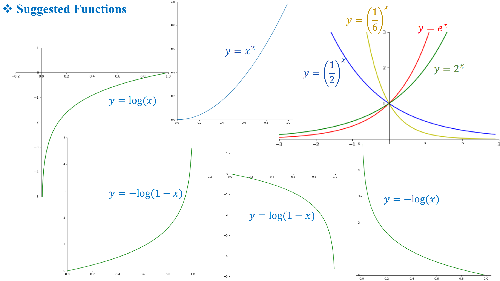
## binary cross entropy
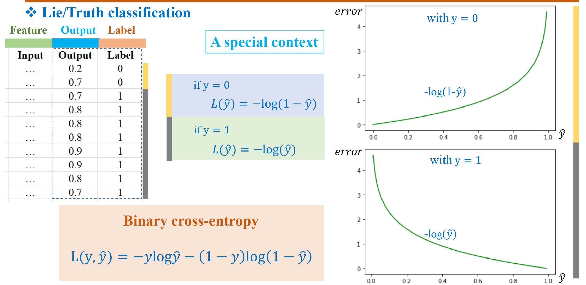
## Imbalance data
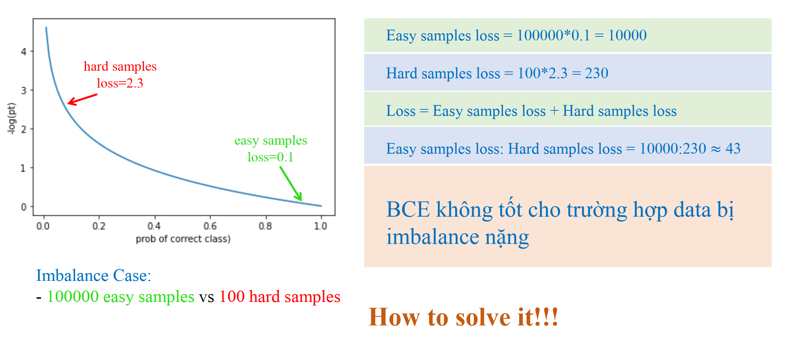
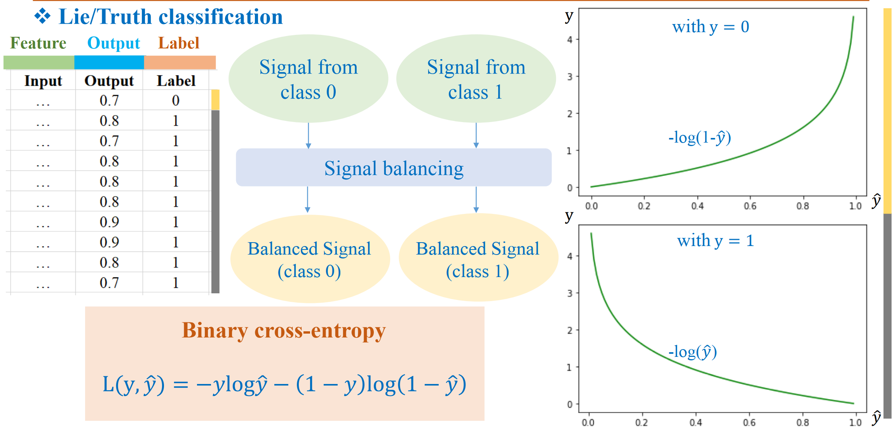
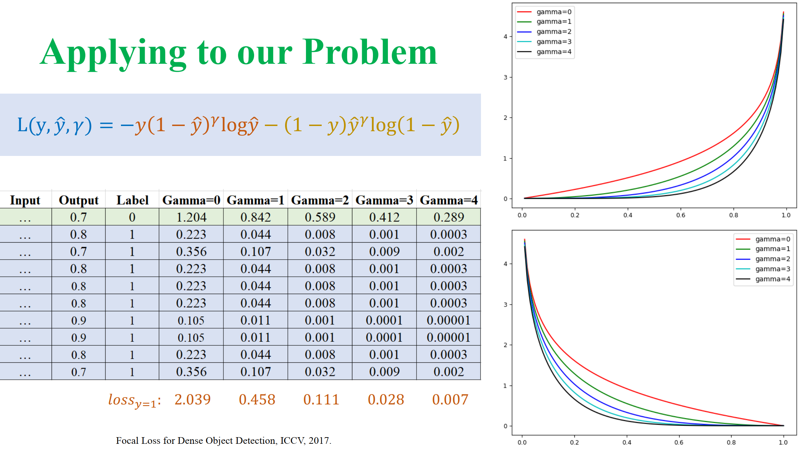 (focal loss)