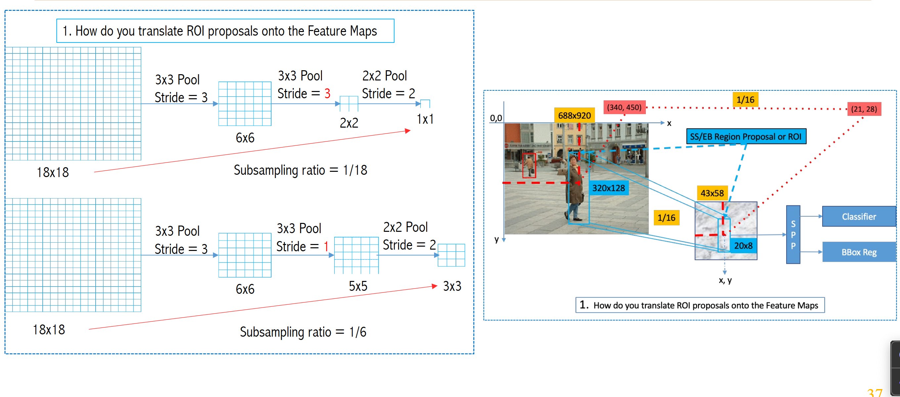

- YOLO

- Transformer

1. RCNN

- Spatial pyramid pooling (hỗ trợ fix size output đầu ra phù hợp cho FC)

- Subsampling ratio

2. Fast-RCNN

- anchor box

3. Faster-RCNN
- dùng anchor box nhiều tỉ lệ để dự đoán vật thể nhiều kích thước

