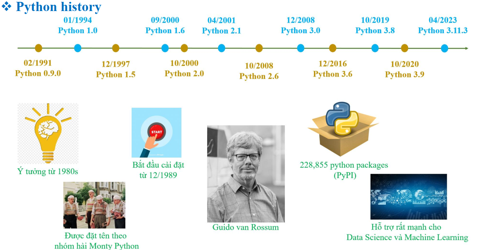
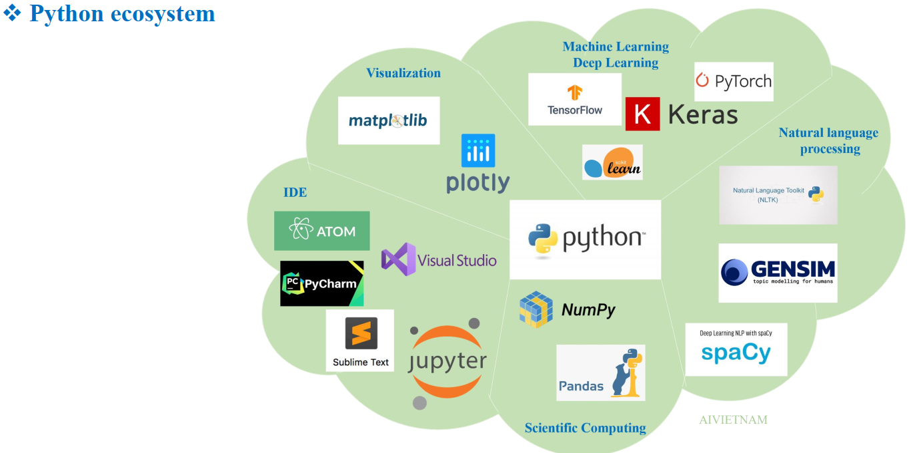
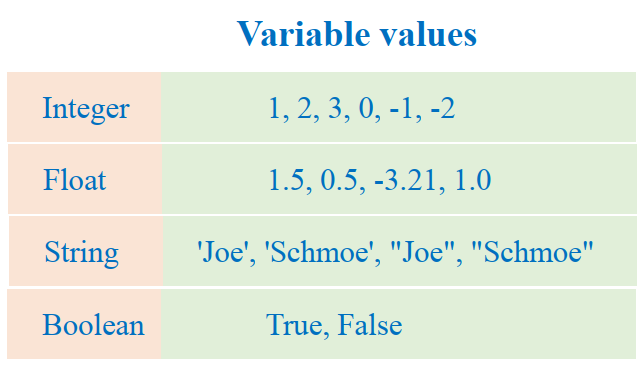
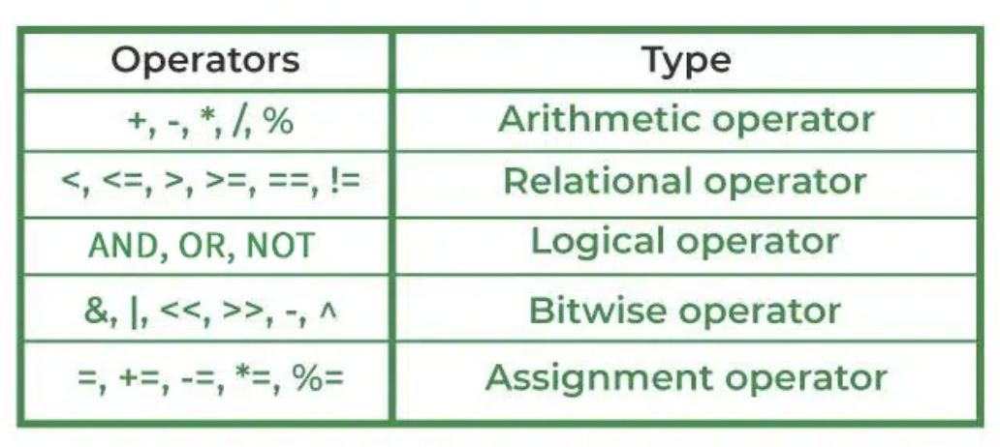
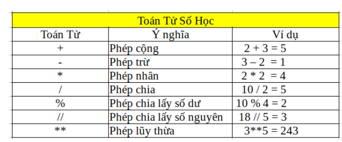
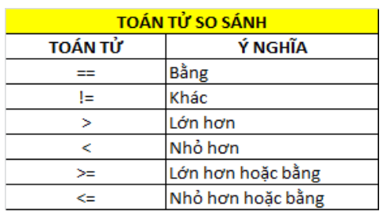
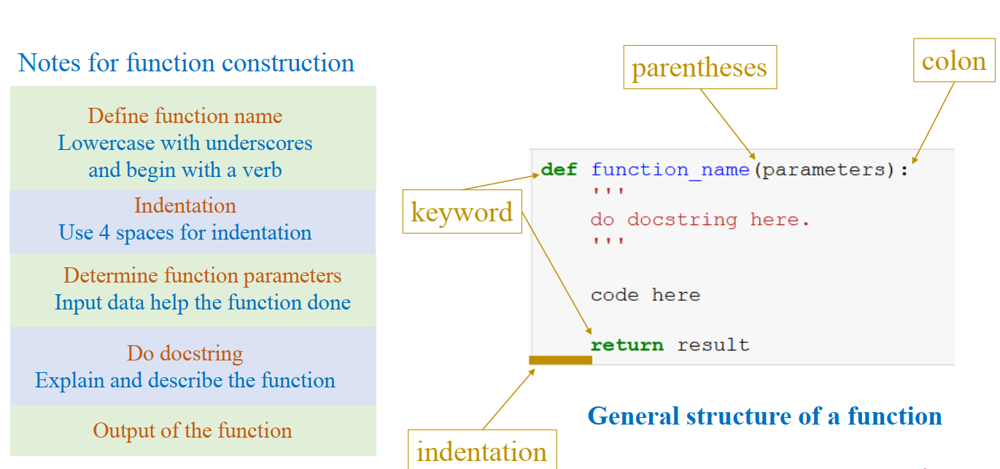
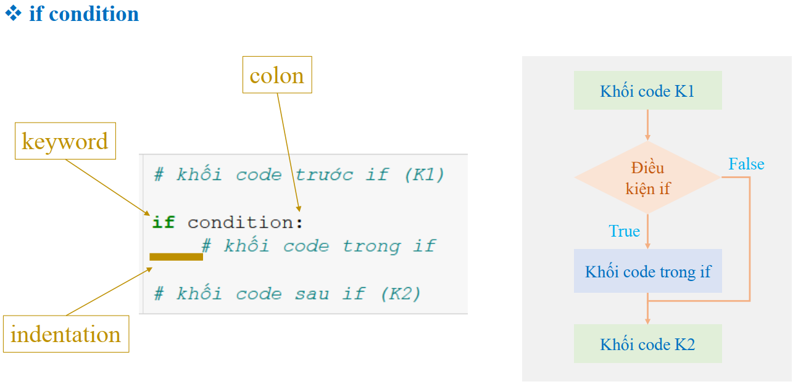
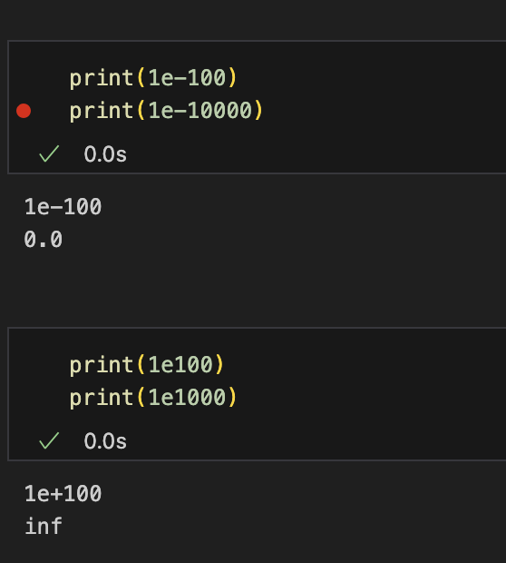
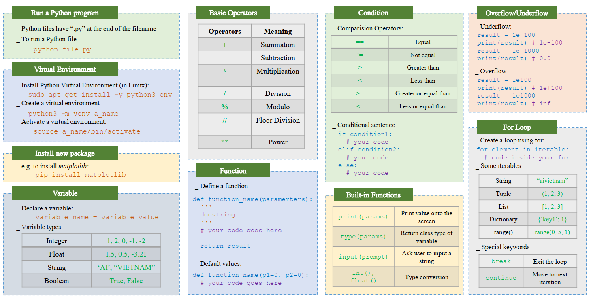

# Python
In this folder, I will study about python
## Python history

## Python ecosystem

## Variable values

## Basic Operators

## Function

## If condition

## Overflow and Underflow

## Summary
