## Tuple

- 
- 
- 
## The dir() function returns all properties and methods of the specified object, without the values

## iterable and iterator

## Check memory usage of tuple and list

## Case study 1 - IoU

## Case study 2 - NMS

## Set
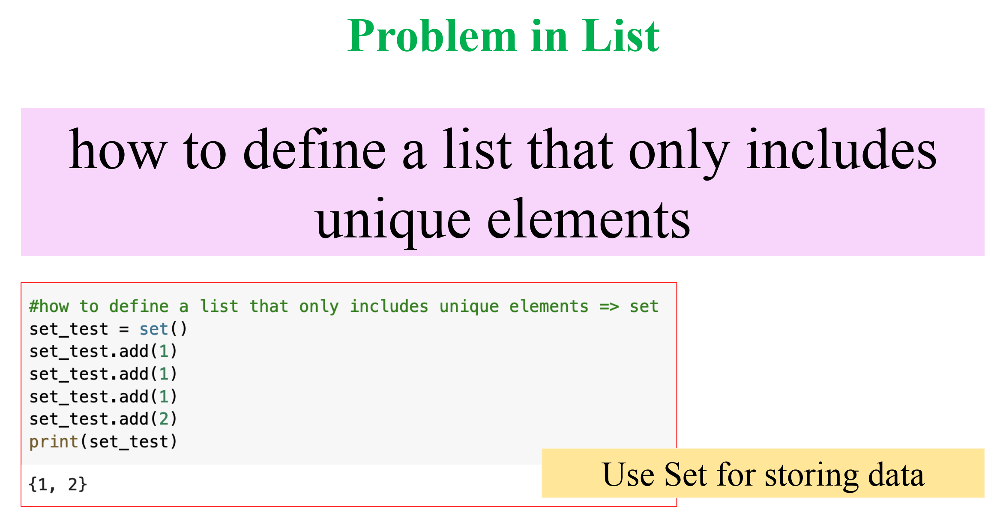
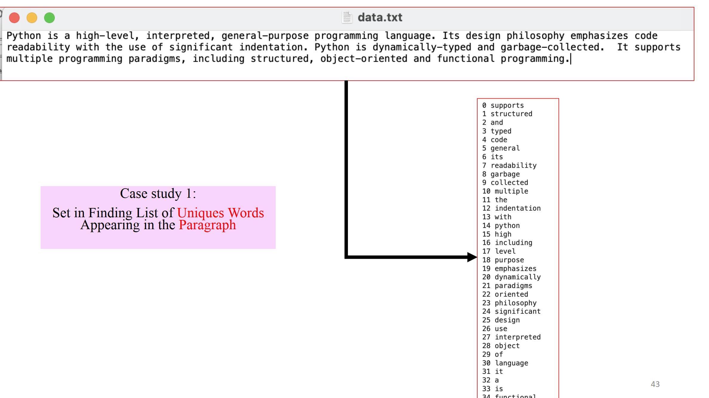
- Create a set
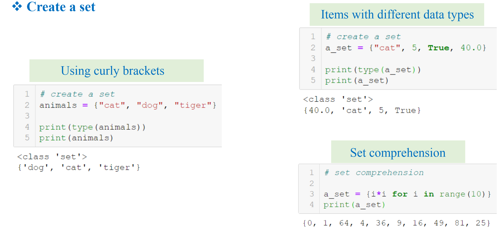
- List of the set operations available in python
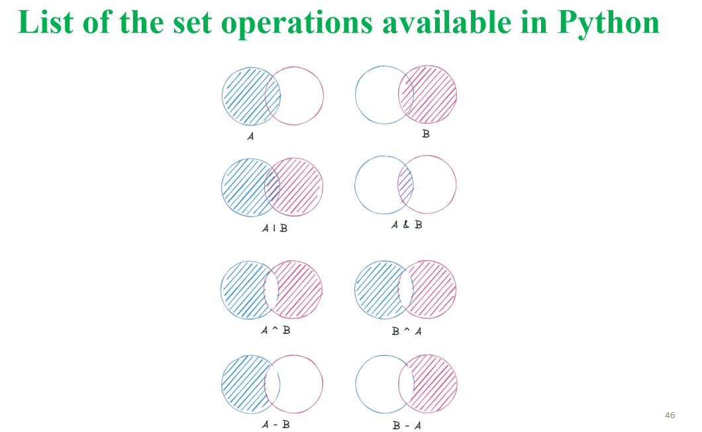
- add, join, insert
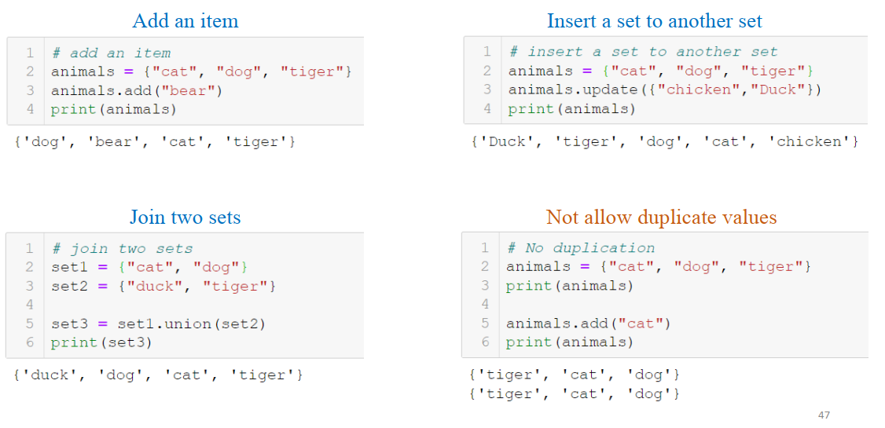
- difference, symmetric
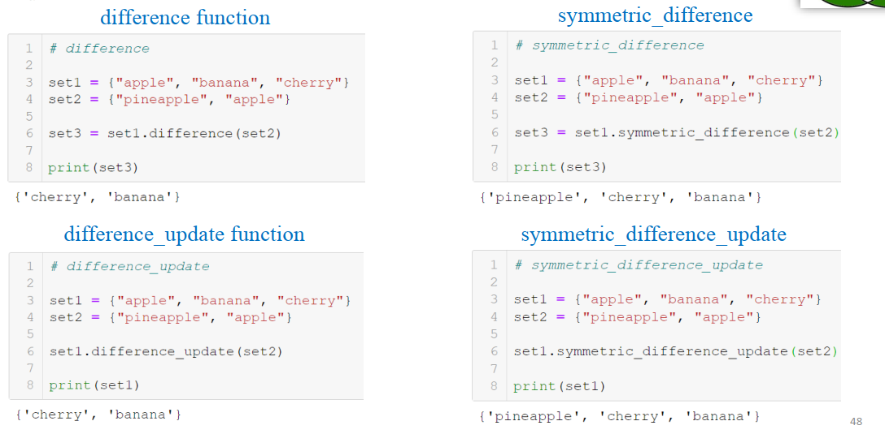
- bitwise operator
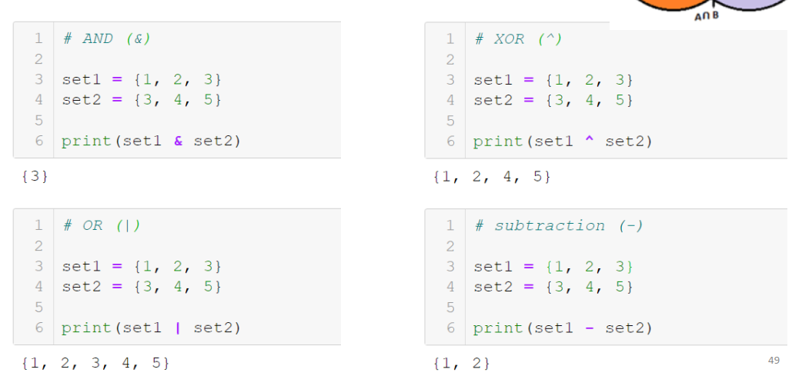
- remove an item
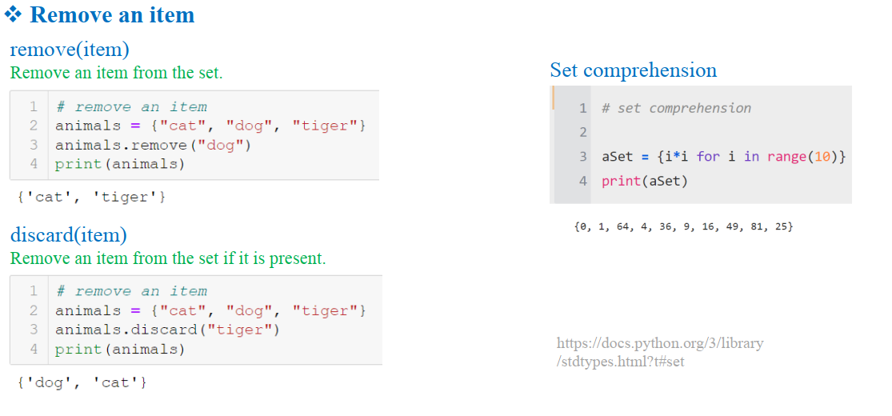
## Dictionary
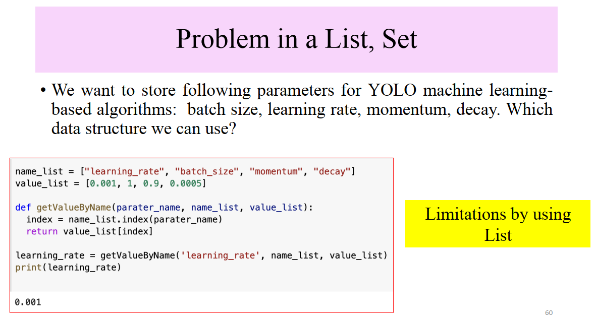
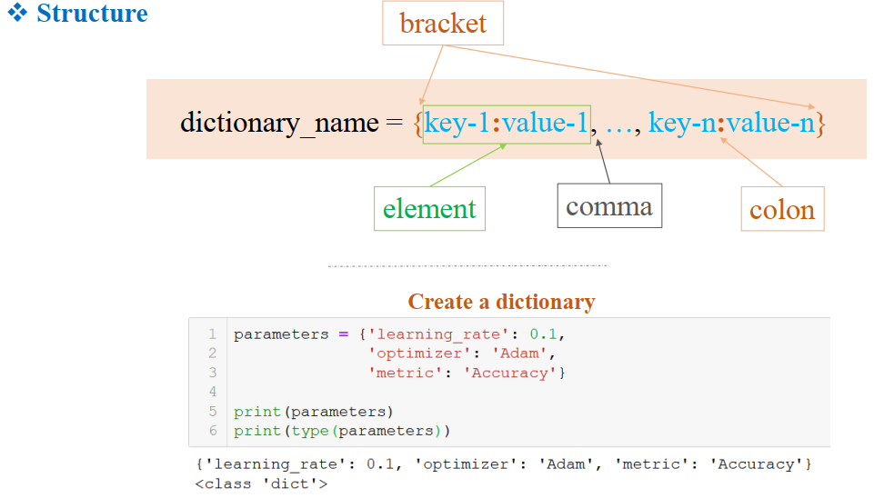
- Create a Dictionary
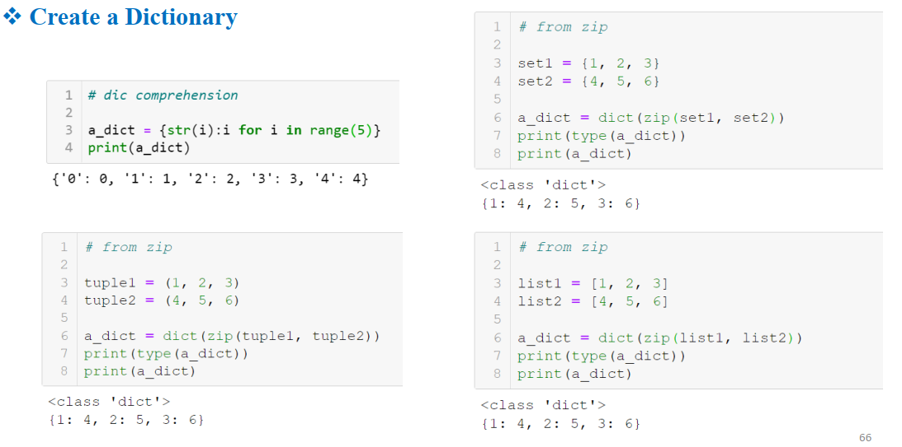
- copy()
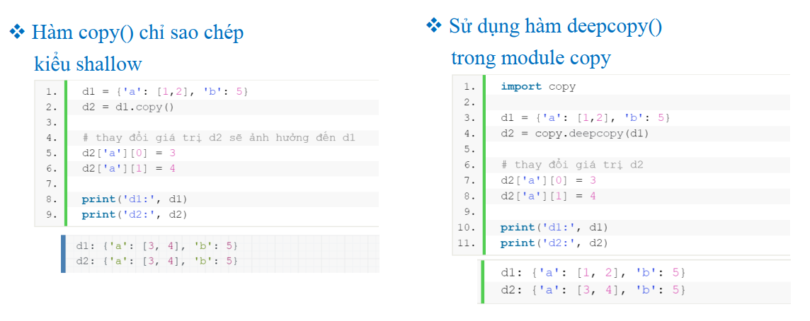
- get keys and values
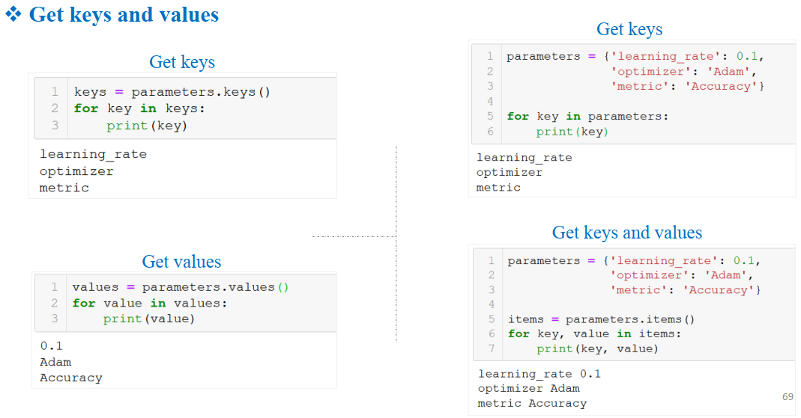
- get a value by a key
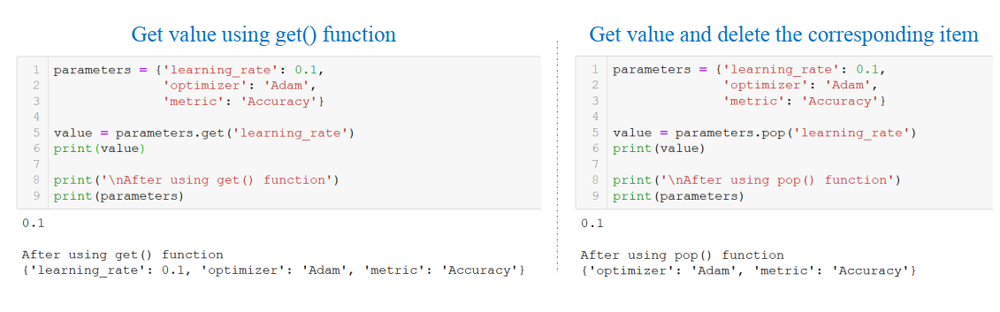
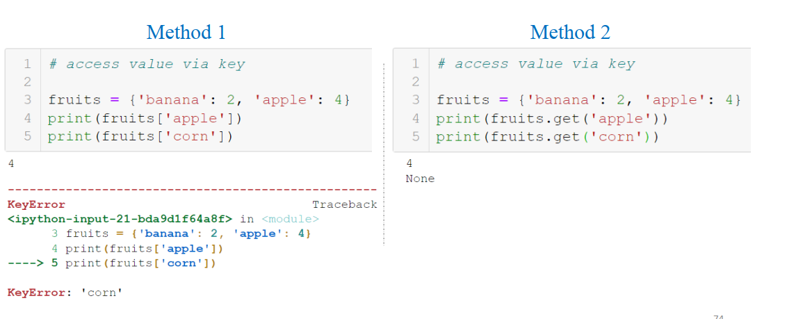
- set default
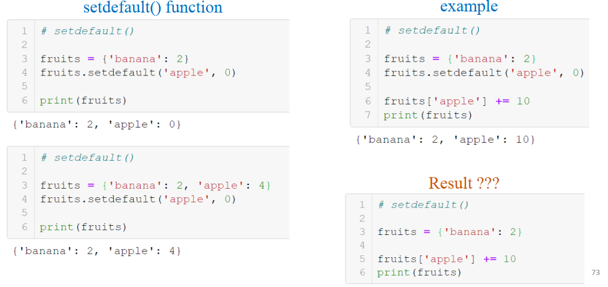
- merge, remove, check
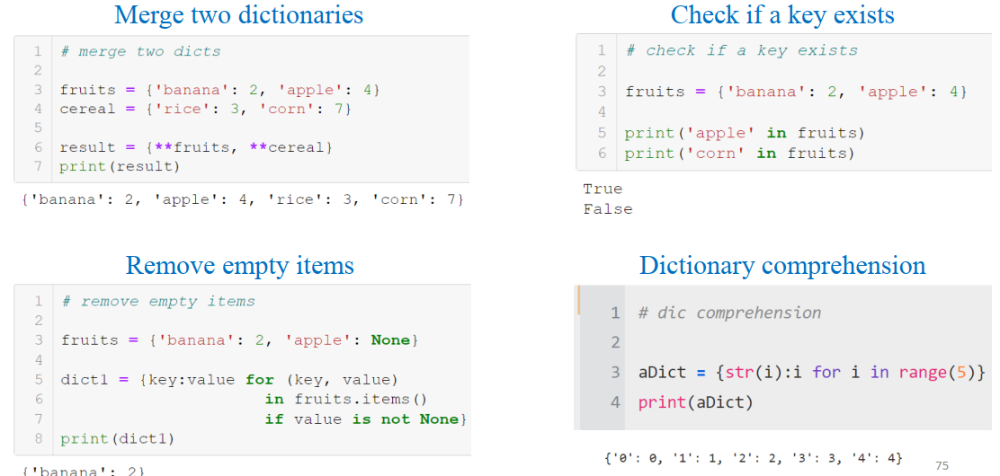
- Sorted advanced
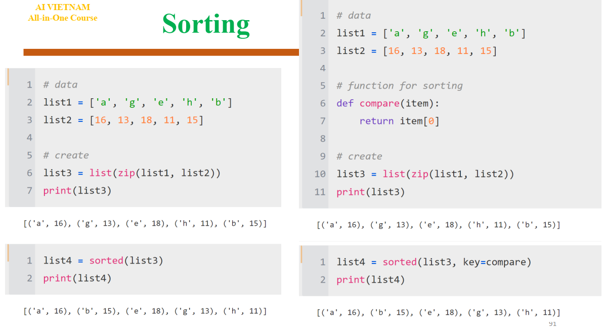
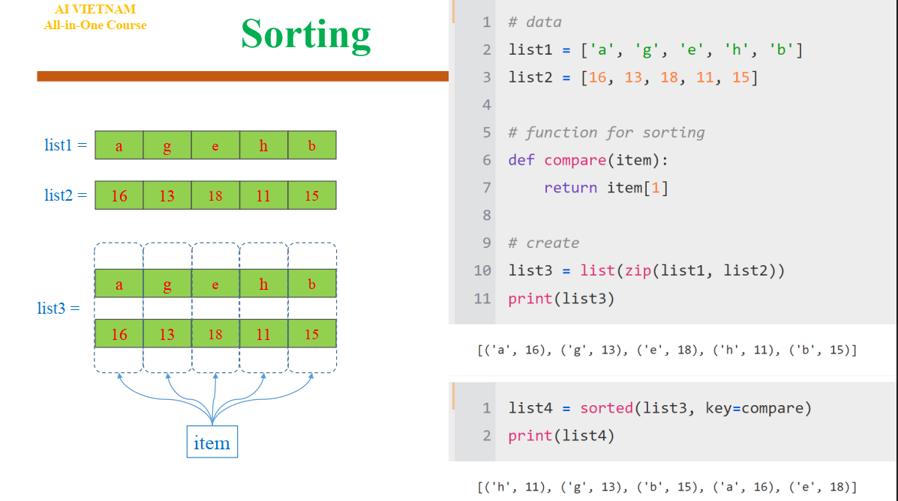
- Lamda function
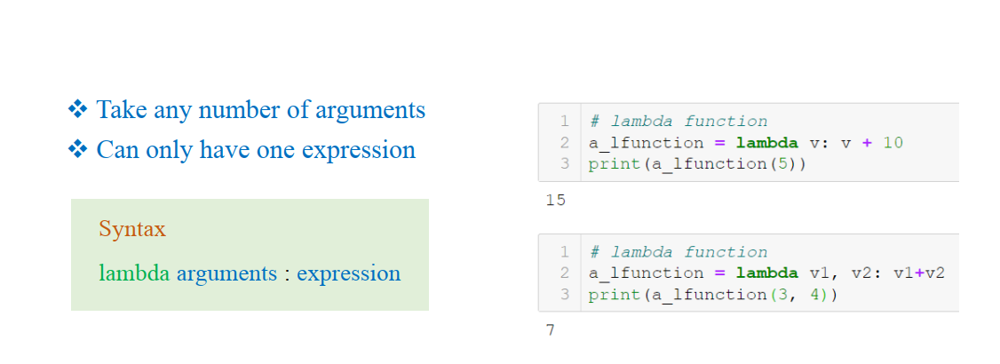
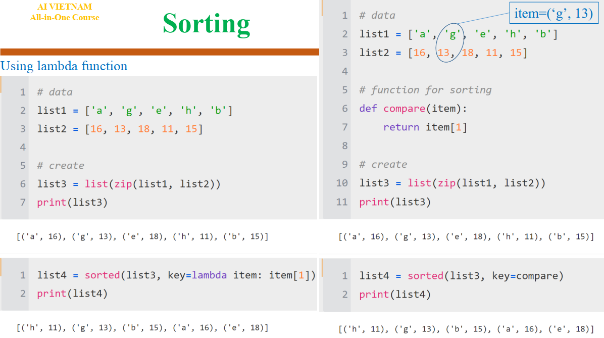