## Tuple
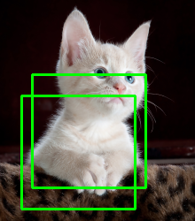
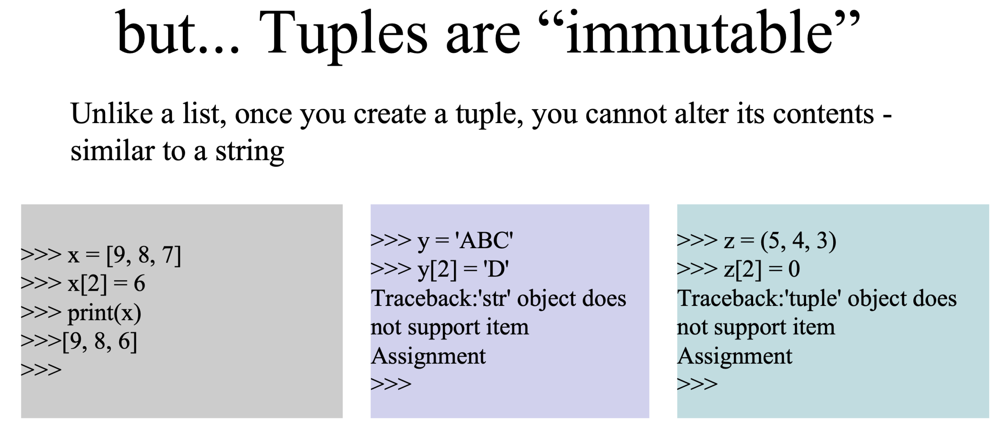
- 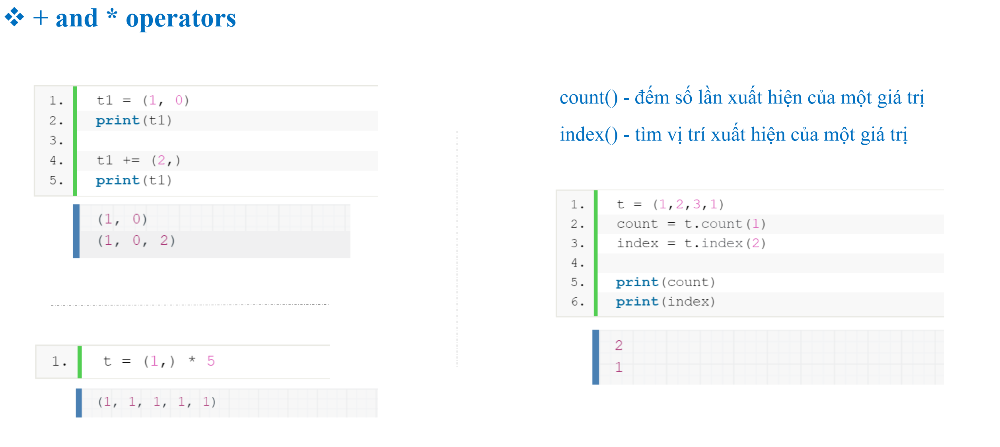
- 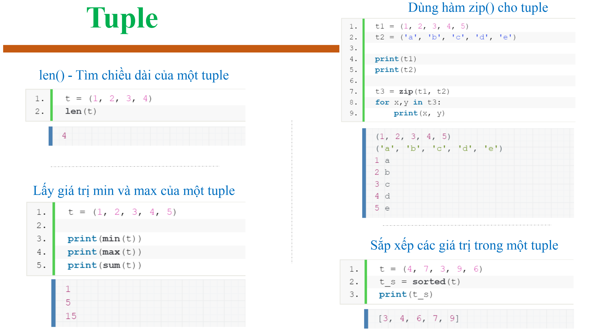
- 
## The dir() function returns all properties and methods of the specified object, without the values
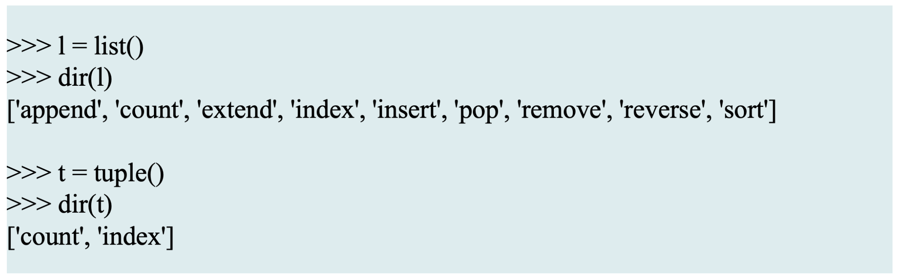
## iterable and iterator
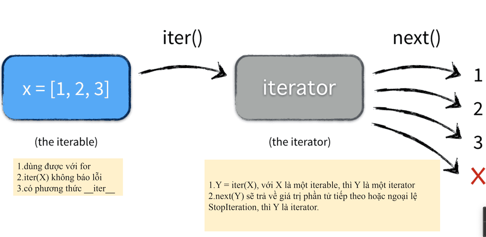
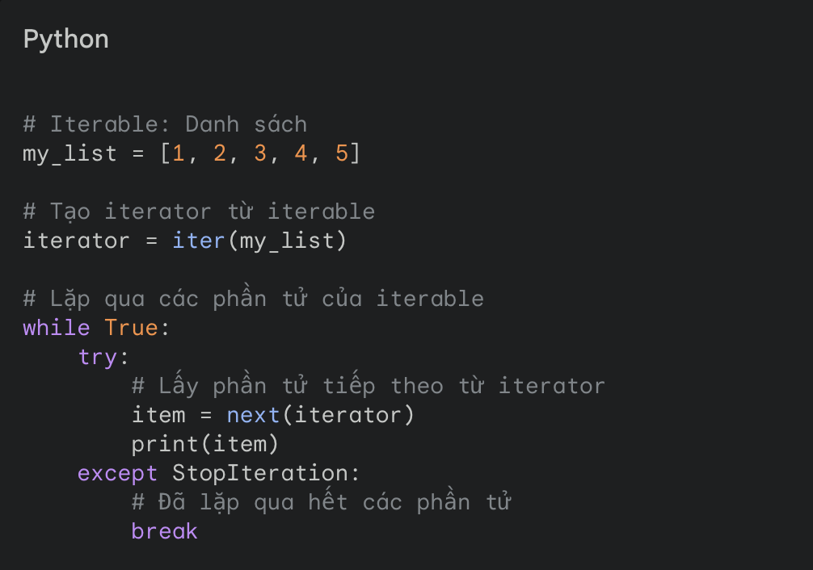
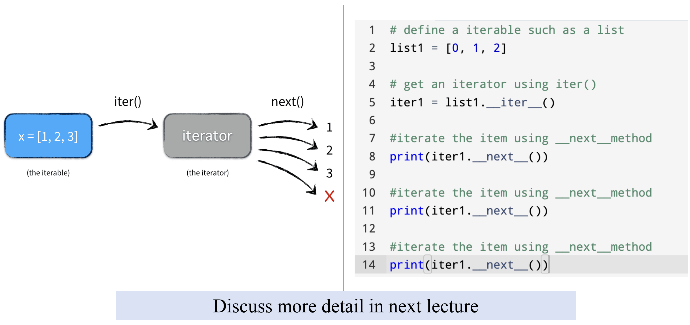
## Check memory usage of tuple and list
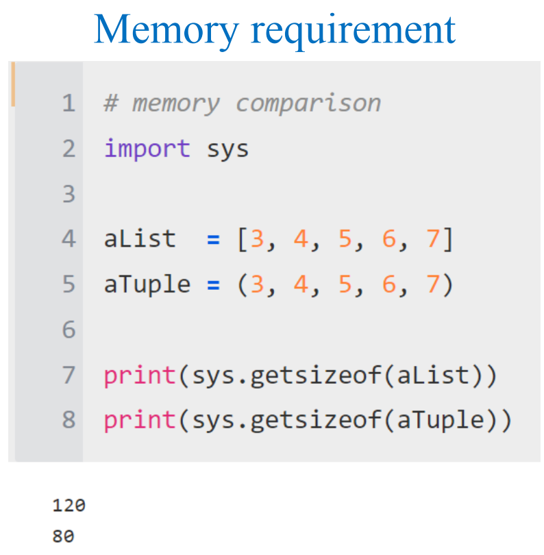
## Case study 1 - IoU
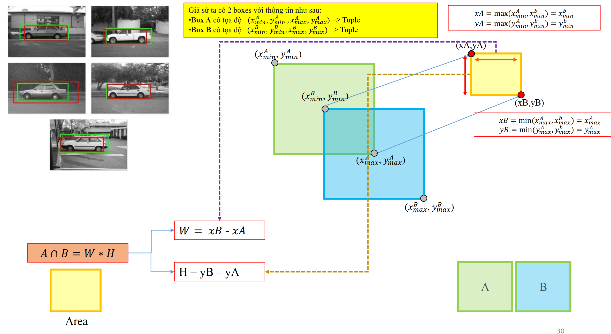

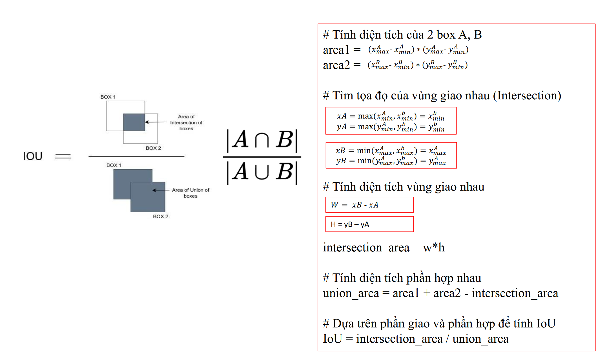
## Case study 2 - NMS
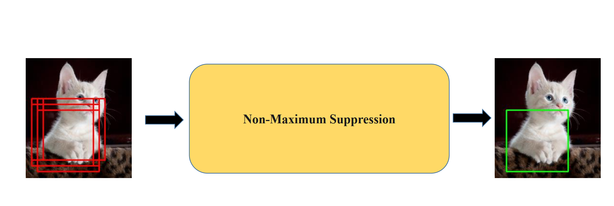
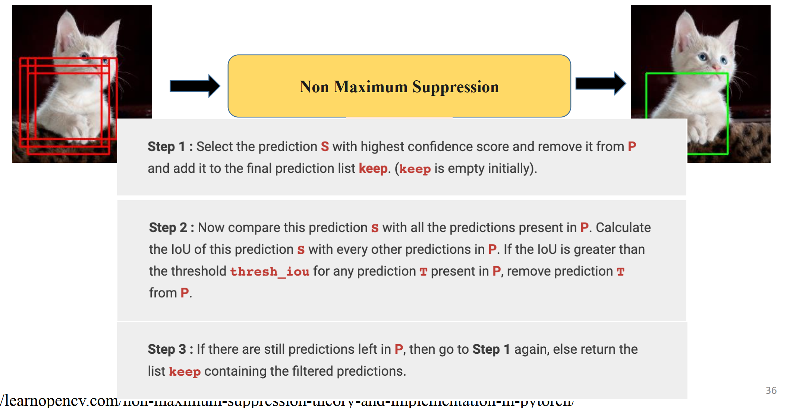