### OOP
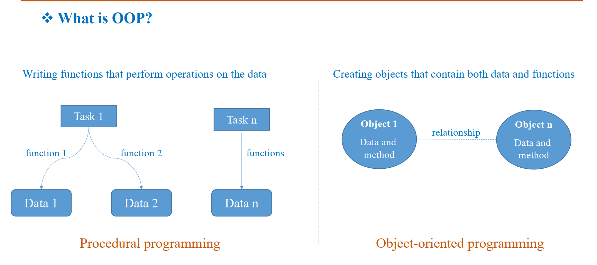
### Class in OOP
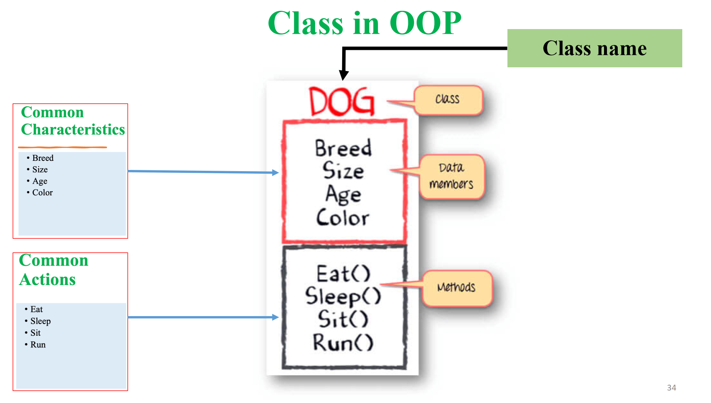
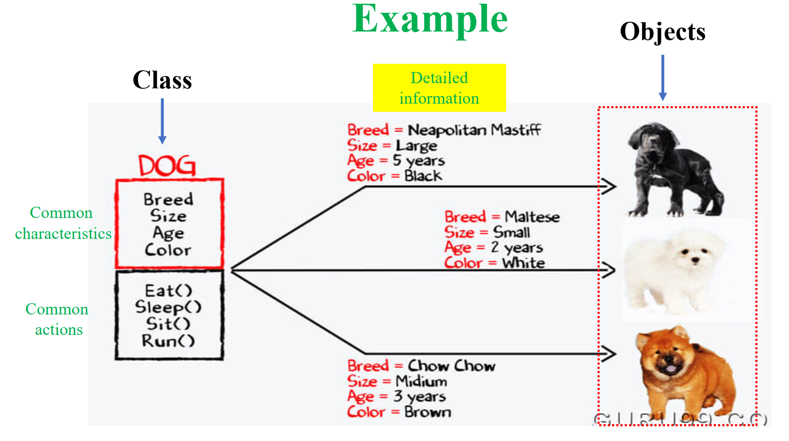
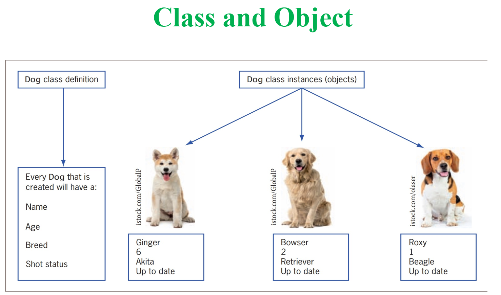
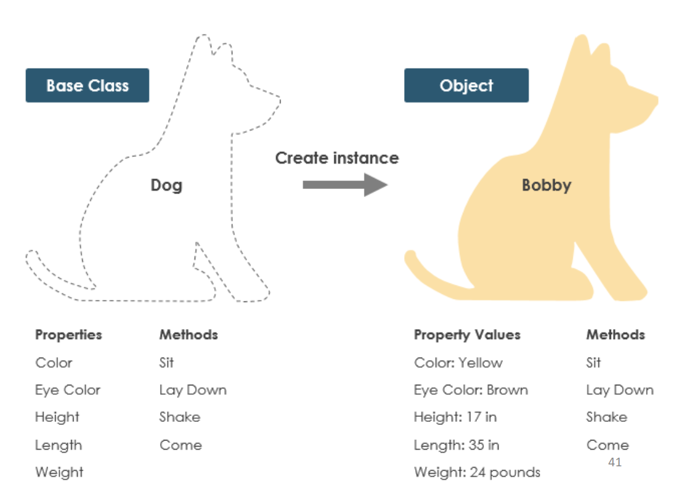
### Creating class in Python
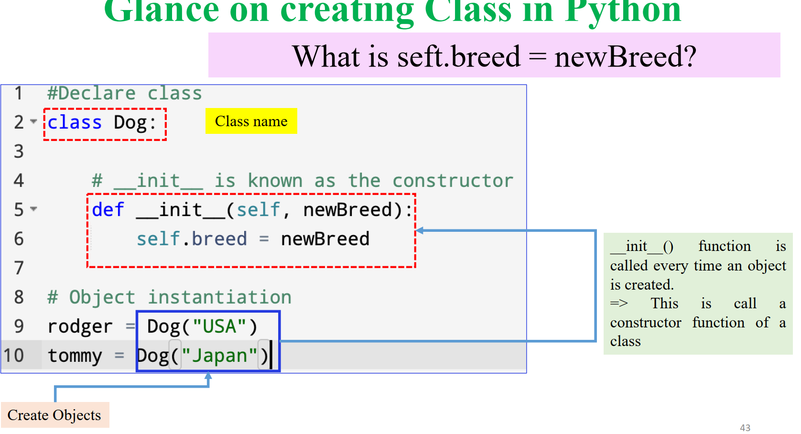
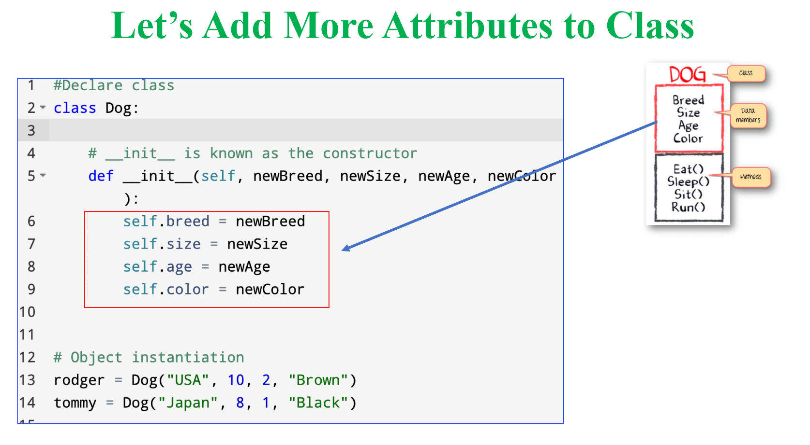
### Private for attribute
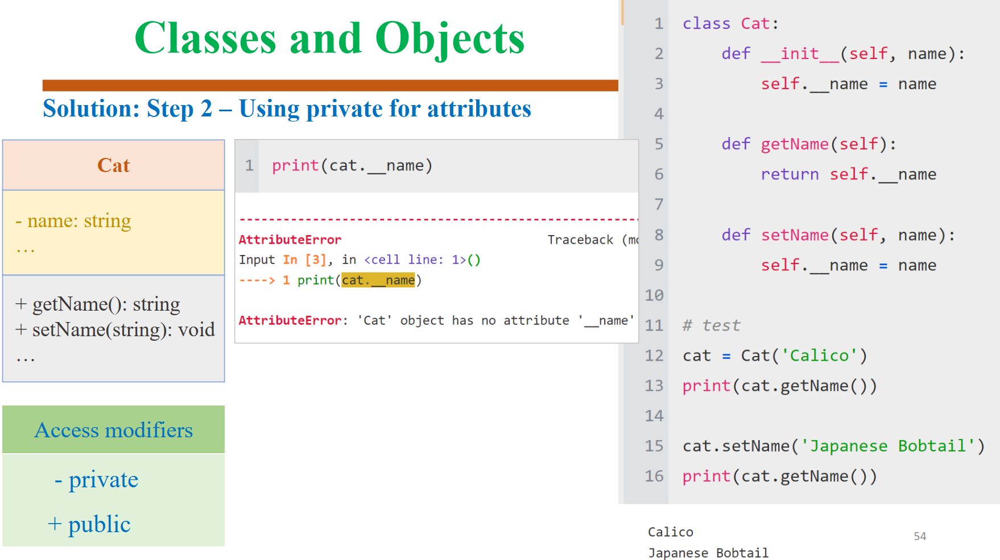
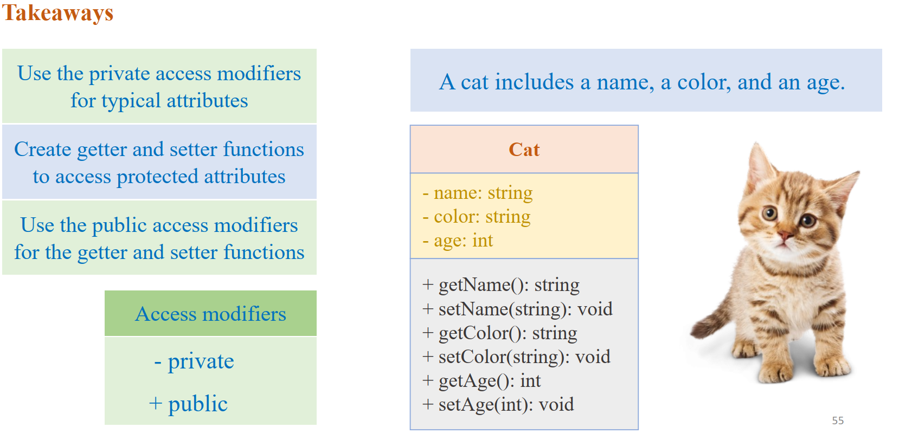
### Object Relationships
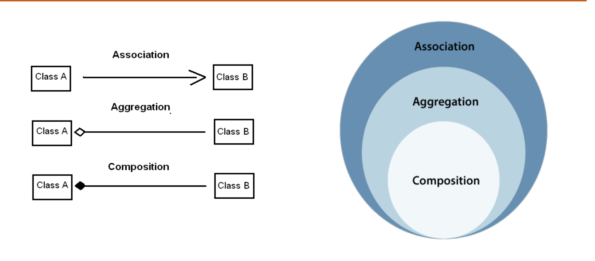
- Composition: mỗi xe thì có 1 động cơ -> xóa xe thì mất động cơ
- Aggregation: xe thì có nhiều hành khác -> xóa xe không mất hành khách
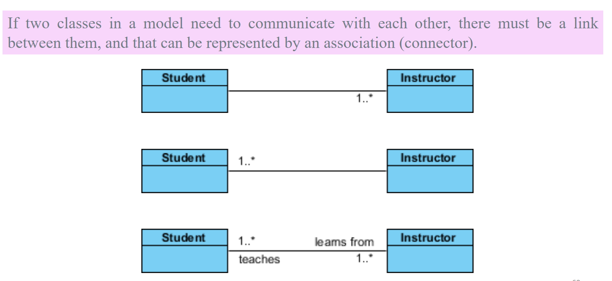
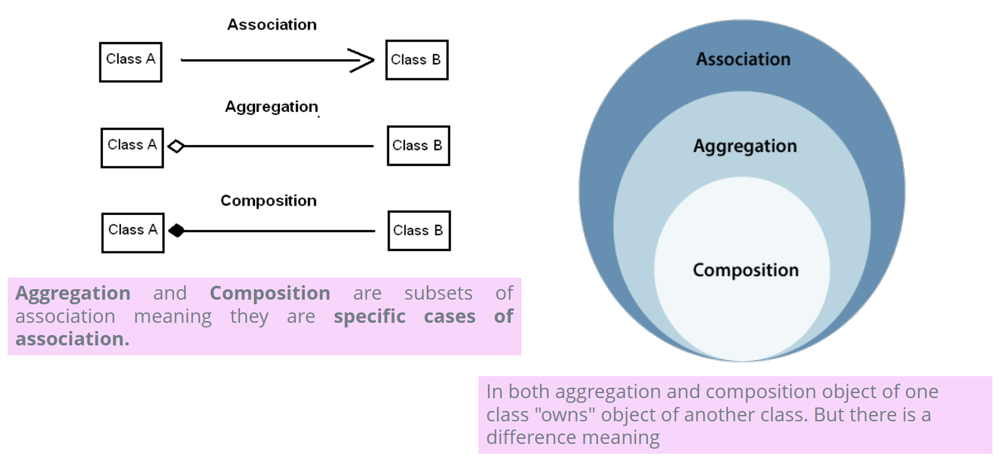