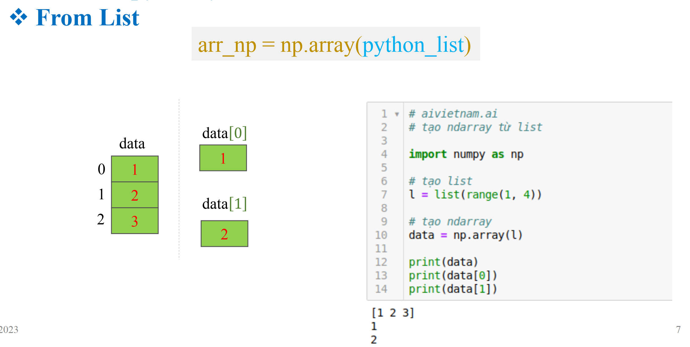
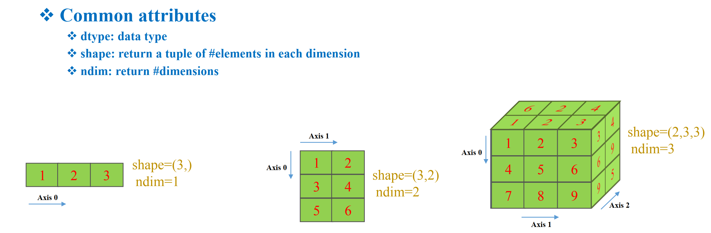
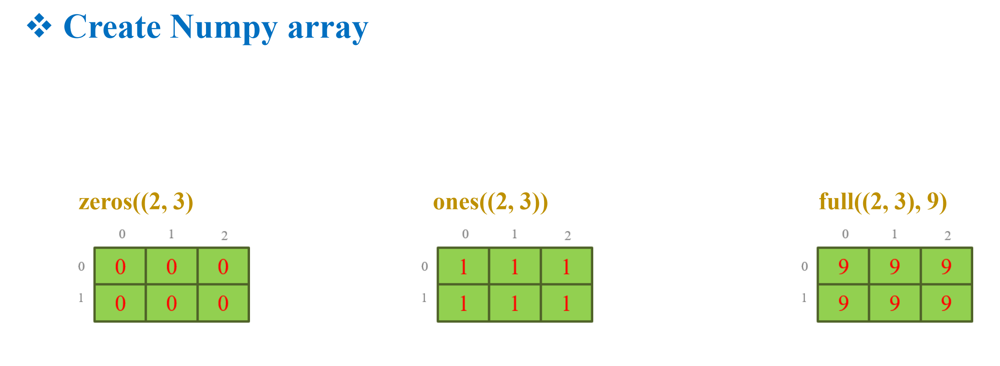
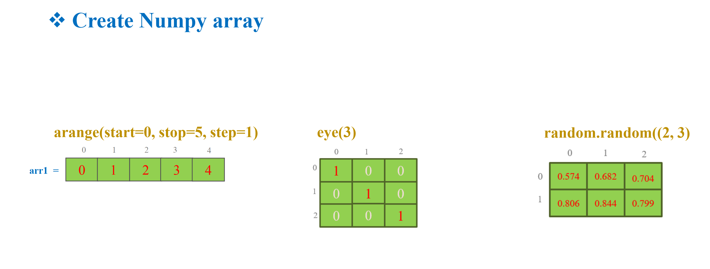
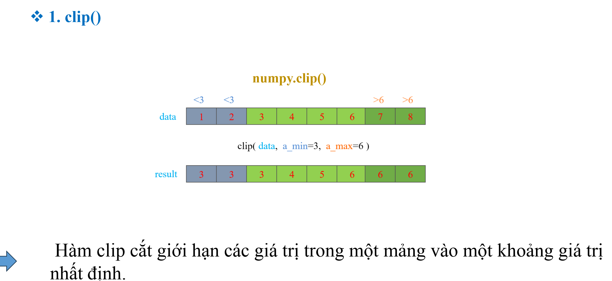
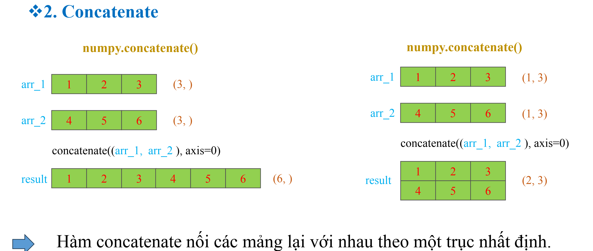
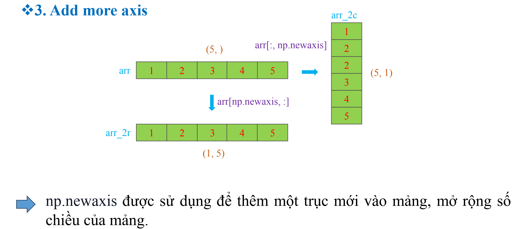
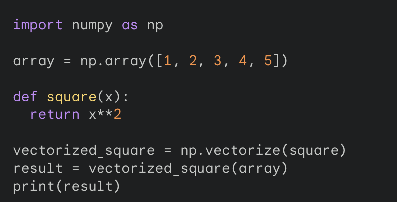
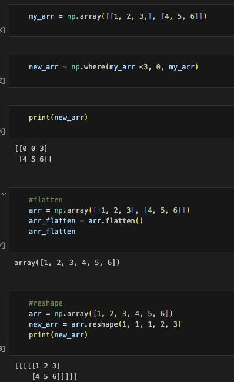

## Create numpy array

## Common atributes

## zeros, ones, full

## arange, eye, random

## important fuction
- CLip

- Concatenate

- add more axis

- vetorize
Vectorize trong NumPy là một kỹ thuật dùng để áp dụng một hàm toán lên từng phần tử của một mảng NumPy. Nói cách khác, nó giúp thực hiện thao tác toán học trên từng phần tử của mảng một cách hiệu quả, thay vì lặp qua từng phần tử và thực hiện thao tác riêng lẻ.

- where, flatten, reshape
