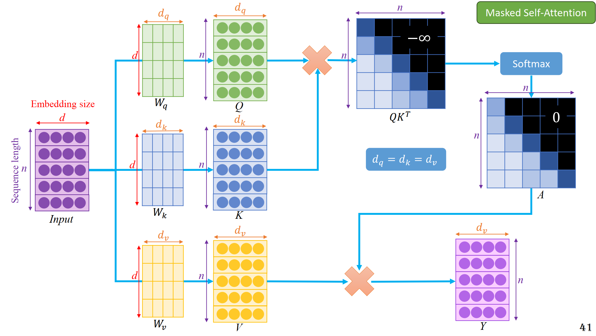

## MLP
- Nhiều tham số
- Global
## RNN/LSTM/GRU limitations
- mất sự kêts nối đối với các từ ở xa

## Transformers

- transformer block

- self (dành cho bài toán phân loại, trích xuất đặc trưng, phân tích câu hỏi, bài toán mà thông tin ở mọi vị trí đều quan trọng)

- mask self ( yêu cầu tính tuần tự nghiêm ngặt, dự đoán từ tiếp theo)
 
 
 
- cross attention (chú yến đến các phần tương ứng trong cả 2 nguồn dữ liệu)

- postion embedding

## Bert (thêm 1 cls cho mục đích classifier)

## Vision Transformer

